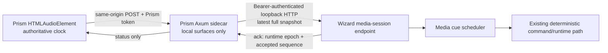

# Role 9 Research: PrismGT Integration Architecture

Date: 2026-07-13

## Scope and repository snapshot

This report audits the actual Python and PrismGT repositories for the Wizard Joe Audiobook Performance Engine and PrismGT Media Connector. It traces the current player clock and events, audiobook APIs and storage, media metadata, browser/sidecar/native boundaries, cross-origin posture, synchronization and reconnect behavior, and external-URL governance. It recommends the smallest connector that preserves audio authority and the existing security boundaries. No production code was changed.

Audited revisions:

- Python: `WizardJoeAvatar-python` at `7781a67c97bfbfa16a64d5b9fb12bdf74bd4c032` on `codex/audiobook-performance-engine`.
- PrismGT: `prism-geometry-talk-current` at `0ce9f9bae665b1415cd776e4d6c9ee23565936ac` on `desktop/prism-gt-influence-integrated`.

The supplied brief requires audio to remain authoritative; deterministic pause, resume, stop, seek, chapter, rate, buffering, reconnect, background, and restart behavior; a thin local connector; no private-path or transcript leakage; no hosted-to-local bypass; and a visible Whiz action that opens only a canonical stored `http` or `https` URL after an explicit click.

## Executive finding

The two applications have compatible building blocks, but no media-session connector exists today.

- PrismGT owns the real `HTMLAudioElement`, loads the selected URL into it, and reads `currentTime` and `duration` directly during its audio-analysis animation loop. That element is the only valid playback clock (`src/pages/PrismDodecahedron/index.jsx:1141-1214`, `src/pages/PrismDodecahedron/musicMotion.js:240-335`).
- The current audio controller observes only `play`, `pause`, `ended`, and `loadedmetadata`. It does not observe `playing`, `waiting`, `stalled`, `seeking`, `seeked`, `ratechange`, `durationchange`, `emptied`, or `error`, so it cannot currently express the full media lifecycle (`src/pages/PrismDodecahedron/musicMotion.js:351-384`).
- Python has a strict, bounded, idempotent ordered command inbox and runtime-epoch acknowledgements, but its supported command kinds are avatar actions rather than media-session state. Its 60 Hz simulation clock is deliberately independent of media time (`wizard_avatar/commanding.py:11-47`, `wizard_avatar/commanding.py:306-399`, `wizard_avatar/controller.py:42-53`).
- PrismGT already protects local mutations with a per-launch token and exact same-origin checks. Wizard binds locally by default, but its current WebSocket accepts before validating `Origin` or authenticating the client (`src/api/session-token.js:1-116`, `crates/prism-cdiss-cli/src/web.rs:554-580`, `wizard_avatar/server.py:197-240`). Direct browser-to-Wizard HTTP would require CORS; direct browser WebSocket would bypass Prism's token boundary and is unsafe as implemented.
- PrismGT has three media sources: a manifest-backed library, persisted ElevenLabs audiobook artifacts, and ephemeral uploaded MP3 object URLs. None carries a canonical external destination through frontend normalization. No Whiz control or governed external-media route exists (`src/pages/PrismDodecahedron/musicLibrary.js:33-77`, `src/lib/media-normalize.js:16-68`, `src/pages/PrismDodecahedron/studio/StageUtilityCards.jsx:347-597`).
- The public hosted router intentionally exposes a reduced player surface and does not expose local audiobook storage. A hosted page cannot safely or reliably control a user's loopback Wizard service. Local Wizard performance must therefore be an explicit `DesktopApp`/`LegacyLocal` capability, not a public-web feature (`crates/prism-cdiss-cli/src/web.rs:420-535`).

**Recommendation:** add one versioned full-state media-session snapshot contract. The Prism page samples the authoritative media element, posts snapshots to a new same-origin local Prism route, and the Rust sidecar relays them over authenticated loopback HTTP to Wizard. Wizard treats each accepted snapshot as a correction to its cue scheduler, never as permission to become the media clock. On reconnect it consumes only the newest complete snapshot, not a backlog of stale events.

For Whiz, add a same-origin navigation route that accepts only a media ID, retrieves the canonical URL from stored metadata, parses and reserializes it, permits only credential-free `http`/`https`, records the governed action, and redirects the explicitly clicked new tab/window. Do not pass a caller-supplied URL to the route, do not infer a URL from title or provider metadata, and do not reuse the playable audio URL as the external destination.

## Current architecture trace

### 1. PrismGT media player and event path

The current player is one hidden audio element plus React controls:

1. Library, ElevenLabs, and uploaded tracks are concatenated into one playlist (`src/pages/PrismDodecahedron/index.jsx:457-461`).
2. Track selection resolves the selected track, optionally remembers whether playback should resume, and changes `currentTrackId` (`index.jsx:1095-1126`).
3. `loadTrackIntoAudio()` resolves the playable URL, assigns `audio.src`, and calls `audio.load()` (`index.jsx:1141-1150`).
4. `playAudioElement()` invokes `audio.play()` and reports rejection; `togglePlayback()` invokes `play()` or `pause()` (`index.jsx:1152-1214`).
5. A `createAudioMotionController()` instance constructs a Web Audio analyser, reads the media element on each animation frame, and emits audio bands plus `currentTime`, `duration`, and progress (`musicMotion.js:230-335`).
6. React state receives throttled analyzer samples at about 90 ms intervals. This state is suitable for display, but the connector must sample the element itself to avoid React scheduling delay (`index.jsx:2858-2896`).
7. Captions are fetched per selected track and active cues are selected from `audioMetrics.currentTime` (`index.jsx:2920-2985`). Timed-text speech uses timers derived from one current-time sample; it does not explicitly reschedule on seek or rate change, which is a pre-existing drift risk for that overlay path.
8. `ended` automatically selects the next playlist item and requests resumed playback (`index.jsx:2987-3005`).

Current player controls expose previous, play/pause, next, tracks, captions, and local MP3 linking. Progress is a meter, not an input, so there is no user seek control. There is no stop, playback-rate, chapter transport abstraction, video element, Whiz action, or connector status (`src/pages/PrismDodecahedron/studio/StageUtilityCards.jsx:347-597`). Podcast groups label tracks as chapters, but each chapter is still an independent playlist track.

The HTML Standard distinguishes play intent from actual resumption: `play` can be followed by `waiting`, while `playing` signals that pending play promises are resolved. It also defines `currentTime` as seconds on the media timeline and seeking by assigning it. Connector state must therefore derive from the element and use `playing` for actual running state, not assume that a `play` event means samples are advancing ([WHATWG HTML media](https://html.spec.whatwg.org/multipage/media.html)).

### 2. PrismGT media APIs and storage

#### Manifest-backed library

- `GET /api/library` reads a configured JSON manifest or a bundled fallback and returns it after media-base rewriting (`crates/prism-cdiss-cli/src/web.rs:676-729`).
- `musicLibrary.js` retains display name, type, access, playable URL, source, show, episode, duration, description, captions, lyrics, and transcript. Unknown fields are dropped, including any future canonical external URL unless normalization is extended (`src/pages/PrismDodecahedron/musicLibrary.js:33-77`).
- The bundled `public/music/playlist.json` carries only ID, name, filename, and playable URL. It contains no media kind beyond the default, canonical source URL, author/artist, chapter identity, or stable content hash.
- The manifest generator recognizes common audio and timed-text extensions and can emit music, podcast, and story records, but its validation is concerned with playable assets and required transcripts, not external provenance (`scripts/generate_media_manifest.mjs:5-8`, `scripts/generate_media_manifest.mjs:140-203`, `scripts/generate_media_manifest.mjs:208-439`).

#### Persisted audiobooks

- Local-only routes list, generate, serve, caption, and delete audiobook records (`crates/prism-cdiss-cli/src/web.rs:514-535`).
- `AudiobookTrack` stores track ID, title, source, status, timestamps, voice/model, MIME type, byte size, optional duration, local audio/caption URLs, preview, and provider source metadata (`crates/prism-cdiss-cli/src/audiobooks.rs:83-101`).
- Generated and Studio chapter audio are written under the Prism data directory at `audiobooks/tracks/<track_id>/` as `audio.mp3`, optional `captions.vtt`, optional `alignment.json`, and `metadata.json`; an index is rewritten after changes. The audiobook root is set to mode `0700` on Unix (`audiobooks.rs:242-275`, `audiobooks.rs:449-533`).
- Audio responses support byte ranges and return `206 Partial Content`, which gives the browser the transport needed for media seeking even though the current UI does not expose it (`crates/prism-cdiss-cli/src/web.rs:6286-6335`; [RFC 9110 range requests](https://www.rfc-editor.org/rfc/rfc9110.html#name-range-requests)).
- Studio `source_meta` retains provider/project/chapter/snapshot IDs, but neither audiobook form stores a canonical public destination. Frontend normalization also drops `duration_seconds` and `source_meta` and forces the UI source to `elevenlabs` (`src/lib/media-normalize.js:42-68`).

#### Ephemeral uploads

- Upload accepts MP3 only, creates a browser blob URL, and uses a random selection component plus file metadata in the UI ID (`src/lib/media-normalize.js:7-39`).
- It is not persisted across reload, has no source URL, and must always produce a disabled Whiz action.

Playable URLs, storage paths, provider provenance, and canonical external destinations are distinct concepts. The connector needs only stable media identity and timing; it must not receive a filesystem path, local playable URL, transcript, caption text, API key, or canonical external URL.

### 3. Browser, sidecar, desktop, and public-web boundaries

Prism's Rust process defines three surfaces:

| Surface | Current behavior | Connector decision |
|---|---|---|
| `DesktopApp` | Tauri starts the embedded Axum binary on loopback with an app data directory and loads it as an external loopback URL. The preferred port is 42817, but an available dynamic port may be chosen (`src-tauri/src/main.rs:49-139`). | Enable the same-origin connector route. Relay server-to-server to configured loopback Wizard. |
| `LegacyLocal` | Axum defaults to `127.0.0.1:3001`; local routes and the token middleware are active (`crates/prism-cdiss-cli/src/web.rs:464-580`). | Enable with the same contract and explicit connector configuration. |
| `PublicWeb` | A reduced router omits audiobook and private local-control routes and may bind publicly only under explicit unsafe/public flags (`web.rs:420-453`, `web.rs:582-604`). | Do not expose or proxy the Wizard connector. Return capability `unavailable_on_public_web`. Whiz navigation may remain available for valid public metadata. |

All Prism local mutations pass through a fetch interceptor that obtains a per-launch token and adds `x-prism-token` only to same-origin `/api/*` mutations. A `403` refreshes the token once (`src/api/session-token.js:18-116`). Rust middleware additionally verifies the exact request origin/host for browser mutations (`crates/prism-cdiss-cli/src/web.rs:7881-7970`). The connector endpoint fits this existing boundary without adding a frontend secret.

Different ports are different origins, including two localhost ports ([FastAPI CORS guidance](https://fastapi.tiangolo.com/tutorial/cors/)). Fetching Wizard directly from Prism would therefore require Wizard CORS policy and would expose a long-lived Wizard credential to browser code. A custom authorization header would trigger CORS preflight under the Fetch Standard ([WHATWG Fetch Standard](https://fetch.spec.whatwg.org/)). That is strictly more exposed than a sidecar relay.

The existing Wizard WebSocket is not an acceptable shortcut. It accepts immediately and applies unacknowledged legacy commands from arbitrary JSON (`wizard_avatar/server.py:203-240`). RFC 6455 states that browser WebSocket servers should validate `Origin` to prevent unauthorized cross-origin use; Wizard does not currently do so ([RFC 6455, sections 1.6 and 10.2](https://www.rfc-editor.org/rfc/rfc6455)).

### 4. Wizard command, timing, and reconnect path

Wizard currently exposes semantic avatar command routes plus `POST /api/avatar/wizard/command`, which parses `CommandEnvelopeV1` and returns a runtime acknowledgement and state (`wizard_avatar/server.py:120-195`). The ordered inbox provides useful semantics:

- exact schema version and strict fields;
- command-ID deduplication;
- increasing source sequence per source epoch;
- TTL and bounded scheduling horizon;
- bounded queue capacity;
- priority and deterministic same-tick ordering;
- acknowledgements carrying disposition, accepted/apply ticks, state revision, and `runtime_epoch` (`wizard_avatar/commanding.py:118-176`, `wizard_avatar/commanding.py:255-295`, `wizard_avatar/commanding.py:306-399`).

Those are action-command semantics, not a media clock. The frame hub creates a new `runtime_epoch` per process and advances a fixed-step runtime from `perf_counter_ns`; the controller derives `time_seconds` from simulation ticks (`wizard_avatar/stream.py:31-74`, `wizard_avatar/stream.py:151-190`, `wizard_avatar/controller.py:42-53`). Frame subscribers can request a visual keyframe after packet loss, but there is no media-session keyframe, media generation, score cancellation, or reconnect reconciliation (`wizard_avatar/stream.py:84-106`).

The existing generic `TransportMessageV1` can serialize strict `hello`, `event`, `state`, `ack`, `resync`, and related messages, but it is not used by the live Wizard WebSocket (`wizard_avatar/transport.py`; `tests/wizard/test_transport.py:12-100`). Reusing its naming and strictness is reasonable; routing media snapshots through the current mixed binary/legacy-command WebSocket is not.

## Smallest robust connector

### Topology



Use HTTP request/response for version 1. Snapshot traffic is small, 4 Hz is sufficient, the current stacks already support HTTP, and acknowledgements make failure visible. A WebSocket adds connection lifecycle and origin/authentication work without improving clock authority. It can be considered only after measured HTTP overhead fails the acceptance targets.

### Prism local route

Add exactly one local-only mutation:

```text
POST /api/connectors/wizard/media-session
Content-Type: application/json
x-prism-token: <existing per-launch token>
```

The browser never supplies a Wizard URL or Wizard credential. The sidecar reads startup configuration such as `PRISM_WIZARD_BASE_URL` and `PRISM_WIZARD_CONNECTOR_TOKEN`, with these constraints:

- base URL must parse to loopback HTTP (`127.0.0.1` or `[::1]`) and an explicit port;
- no redirects, DNS hostnames, URL credentials, fragments, or per-request destination override;
- short connect/read timeout, bounded response body, and bounded in-flight request count;
- token remains backend-only and is sent as `Authorization: Bearer ...`;
- connector failure never pauses, seeks, or otherwise changes audio playback;
- route is absent or returns a typed unavailable status on `PublicWeb`.

Wizard should bind the connector endpoint to loopback and require the configured bearer token with constant-time comparison. A browser `Origin` is not expected from the server-to-server relay; if one is present, reject it unless an intentionally documented trusted origin policy is later added.

### Canonical snapshot contract

Every message is a full, independently useful state sample. Do not send a queue of `play`, `pause`, or gesture commands whose meaning depends on earlier delivery.

```json
{
  "schema_version": 1,
  "connector_session_id": "b8ffeb6f-36d2-4c4e-91a4-b6a3760ccca7",
  "sequence": 42,
  "cause": "seeked",
  "sampled_at_monotonic_ms": 937510.25,
  "media": {
    "media_id": "studio-chapter-book7-04-snapshot9",
    "kind": "audiobook",
    "chapter_id": "04",
    "duration_ms": 1284220,
    "generation": 3
  },
  "playback": {
    "state": "playing",
    "position_ms": 418220,
    "rate": 1.0,
    "ready_state": 4,
    "seeking": false
  },
  "performance": {
    "character_id": "wizard-joe",
    "intensity": 0.7,
    "reduced_motion": false,
    "score_id": "book7-performance",
    "score_revision": 5,
    "score_sha256": "<64 lowercase hex>"
  }
}
```

Required rules:

- Reject unknown fields, unsupported schema versions, non-finite numbers, negative positions/durations, rates outside the product's supported range, malformed IDs, and inconsistent state such as `ended` before duration.
- `connector_session_id` is new for each Prism player/page lifetime. `sequence` increases within it. `media.generation` increases on track, chapter, source reload, explicit stop/reset, or hard seek discontinuity.
- `cause` is one of `initial`, `loadedmetadata`, `play`, `playing`, `pause`, `waiting`, `stalled`, `seeking`, `seeked`, `ratechange`, `durationchange`, `ended`, `emptied`, `error`, `stop`, `trackchange`, `chapterchange`, `visibilitychange`, `heartbeat`, or `reconnect`.
- `playback.state` is one of `empty`, `loading`, `paused`, `playing`, `buffering`, `seeking`, `ended`, `stopped`, or `error`. State is derived from the element and the explicit Stop command; `play` alone does not yield `playing`.
- Persisted time uses integer milliseconds. The frontend samples seconds from the element and converts once using a specified nearest-millisecond rule. The Wizard scheduler performs its own deterministic millisecond-to-tick conversion.
- `media_id`, chapter, score identity, and performance settings are allowed. Playable URL, external URL, local path, transcript/caption text, provider prompt, API key, and persona private data are forbidden.
- `intensity` is bounded `[0, 1]`; reduced-motion is explicit and defaults to the stronger reduction when Prism and Wizard settings disagree.

Response:

```json
{
  "schema_version": 1,
  "connector_session_id": "b8ffeb6f-36d2-4c4e-91a4-b6a3760ccca7",
  "accepted_sequence": 42,
  "disposition": "accepted",
  "wizard_runtime_epoch": "wizard-5b7d...",
  "resync_required": false,
  "capabilities": {
    "media_session_v1": true,
    "max_snapshot_hz": 8,
    "supported_rates": [0.5, 0.75, 1.0, 1.25, 1.5, 2.0]
  }
}
```

The same `(session, sequence)` returns `duplicate` without a second effect. A lower sequence returns `stale`. A new Wizard runtime epoch or unknown session returns `resync_required: true`; Prism immediately sends a `reconnect` snapshot with the current element state. Unsupported score/media identity returns a typed rejection and leaves audio untouched.

### Event capture and send policy

Attach a dedicated adapter to `audioRef.current`; do not modify `musicMotion.js` into a network transport and do not post its animation-frame samples.

| Trigger | Snapshot behavior |
|---|---|
| Track/source selection and `loadedmetadata` | Increment generation for a true source change; send identity, duration, current position, and loading/paused state. |
| `play` | Send intent sample, but retain loading/buffering unless the element is actually ready. |
| `playing` | Send `playing` immediately and start heartbeat. |
| `pause` | Send `paused` immediately unless explicit Stop set `stopped`. Cancel future cue dispatch. |
| `waiting` or `stalled` | Send `buffering`; hold/fade to a deterministic neutral performance and stop advancing media cues. |
| `seeking` | Increment generation, send `seeking`, and cancel queued media-derived actions. |
| `seeked` | Send authoritative position and reconstructed active score state; resume only when element state supports it. |
| `ratechange` | Send the exact current rate and recompute interpolation. |
| `durationchange` | Send corrected duration; never silently scale score cues. |
| `ended` | Send final position and `ended` before the existing next-track transition creates a new generation. |
| `emptied` or `error` | Clear/cancel the media session and report typed status. |
| Explicit Stop | Prism executes `pause()`, sets position to the product-defined start, and sends `stopped` with a new generation. Pause at position zero is not inferred as Stop. |
| `visibilitychange` / page lifecycle | Send an immediate sample before hidden when possible and an immediate reconciliation when visible. |
| Heartbeat | While actually playing, send at 4 Hz, coalescing so only one request is in flight and one newest sample is pending. |

The HTML page-visibility transition fires `visibilitychange`, which is the appropriate reconciliation trigger ([WHATWG page visibility](https://html.spec.whatwg.org/multipage/interaction.html#page-visibility)). Background timer delivery is not a clock guarantee. If Wizard receives no sample for 1.5 seconds, it may extrapolate position only for low-risk continuous state, must mark the session `uncertain`, and must not launch new expressive cues until a fresh snapshot arrives. Audio always wins when the next sample arrives.

### Synchronization and drift policy

Wizard stores the latest accepted tuple `(session, generation, sequence, sampled position, sampled monotonic receipt time, rate, state)`. Between snapshots:

```text
estimated_media_ms = sampled_position_ms
                   + local_elapsed_ms * playback_rate
```

This estimate is interpolation only. It is never persisted as truth and is used only while state is `playing`, the sample is fresh, and no seek/buffer/error is active. Each new snapshot replaces it with the actual `currentTime` sample.

Correction policy:

1. On generation change, seek, chapter/track change, reconnect, stop, or Wizard restart: cancel all pending media-derived commands, resolve the score at the supplied position, set continuous face/body/gaze state, and resume future cue dispatch from that point.
2. On ordinary heartbeat drift up to 100 ms: adjust the interpolation anchor without replaying cues.
3. Above 100 ms: treat as a hard discontinuity, cancel pending cues, and reconstruct.
4. Never speed up avatar simulation to catch up and never replay missed expressive cues in a burst. The frame hub already drops missed presentation deadlines rather than bursting (`wizard_avatar/stream.py:184-190`; `tests/wizard/test_stream_hub.py:68-100`).
5. Dispatch compiled score actions through the existing ordered command path at tick boundaries. Keep the long score outside the bounded command inbox; use a rolling lookahead within its supported horizon.

### Reconnect and restart

- Prism keeps only the newest unsent full snapshot. It retries with exponential backoff and jitter from 250 ms to 5 seconds. It does not replay stale heartbeats.
- A successful response carrying a different `wizard_runtime_epoch` forces a full resync.
- Sidecar restart is already handled for Prism's own session token by one `403` refresh. The connector adapter then sends `reconnect` with a new connector session if page state was recreated.
- Wizard restart loses active media scheduler state by design; the next snapshot reconstructs it. Audio playback is not restarted or altered.
- Prism page reload creates a new connector session and samples the newly created media element. If product persistence later restores playback position, restoration must complete before the initial connector snapshot.
- If Wizard is down, unavailable status is visible but non-modal; playback, captions, and visualizer continue.

## Exact integration points

### PrismGT

| File/area | Minimal change in an implementation phase |
|---|---|
| `src/pages/PrismDodecahedron/index.jsx` near the existing audio-controller effect at `2858-2896` | Instantiate one `MediaSessionConnector` around `audioRef.current`; provide selected media/chapter/score/performance identity; clean up listeners on unmount. Read the element directly. |
| New `src/pages/PrismDodecahedron/mediaSessionConnector.js` | Strict snapshot builder, event mapping, generation/sequence state, 4 Hz coalesced heartbeat, retry/backoff, visibility reconciliation, and no media-content fields. |
| `crates/prism-cdiss-cli/src/web.rs` local router near audiobook routes | Add local-only `POST /api/connectors/wizard/media-session`, connector status, strict body limit, existing token/origin middleware, relay timeout, and typed error mapping. Do not add it to `build_public_router`. |
| Rust connector module beside `web.rs` | Parse fixed startup endpoint, enforce loopback/no redirects, keep bearer token backend-only, coalesce requests if needed, and expose health metrics without secrets. |
| `crates/prism-cdiss-cli/src/audiobooks.rs:83-101` | Add optional, backward-compatible logical book/chapter/media-kind fields and canonical external URL metadata only where there is a real destination. Do not send that URL to Wizard. |
| `scripts/generate_media_manifest.mjs` | Accept, validate, and emit `canonicalExternalUrl` and explicit media `type`; reject malformed canonical URLs during generation. |
| `src/pages/PrismDodecahedron/musicLibrary.js:33-77` and `src/lib/media-normalize.js:42-68` | Preserve normalized media kind, book/chapter IDs, duration, and canonical external URL. Keep playable URL and external URL separate. |
| `src/pages/PrismDodecahedron/studio/StageUtilityCards.jsx:423-457` | Add the accessible Whiz action beside player actions. Disabled when the selected media is not music/video or lacks a valid canonical URL. |
| Constitution/action registry and ledger route definitions | Register `media.open_external` as a narrow user-click action with media-ID-bound payload and audit fields. It must not be callable by model/tool autonomy. |

`musicMotion.js` remains presentation analysis. `src-tauri` needs no change for the baseline Whiz redirect design. If platform testing proves `_blank` navigation does not reach the default browser, the official Tauri opener plugin is the fallback, but it must be separately scoped; Tauri blocks dangerous opener commands by default, and this app's webview is a remote loopback URL rather than bundled frontend code ([Tauri opener](https://v2.tauri.app/plugin/opener/), [Tauri capabilities and remote access](https://v2.tauri.app/security/capabilities/)). Do not grant broad remote Tauri API access merely to make Whiz work.

### Wizard Python

| File/area | Minimal change in an implementation phase |
|---|---|
| New `wizard_avatar/media_session.py` | Frozen strict snapshot/ack types, validation, session/generation/sequence dedupe, freshness, interpolation, and resync state. |
| `wizard_avatar/server.py` | Add authenticated loopback `POST /api/avatar/wizard/media-session` and optional read-only connector diagnostics. Enforce a small JSON body and reject browser origins. |
| `wizard_avatar/stream.py` / deterministic runtime boundary | Apply accepted media corrections at a tick boundary, expose `wizard_runtime_epoch`, cancel superseded cue commands, and write media-session transitions to replay diagnostics without private content. |
| Performance scheduler owned by the engine workstream | Resolve the accepted compiled score at an arbitrary media position, maintain continuous state, and dispatch only bounded-lookahead commands through `OrderedCommandInbox`. |
| `wizard_avatar/transport.py` | Reuse strict version/type conventions if helpful, but do not route snapshots through the current mixed frame WebSocket. |
| Tests | Add contract, auth, idempotency, seek/reconnect, drift, and no-content-leak tests. Existing command and stream tests remain regression gates. |

## Whiz canonical external-URL governance

### Metadata contract

Add one nullable field to a durable media record and preserve it through all normalization layers:

```json
{
  "canonicalExternalUrl": "https://publisher.example/books/wizard-joe",
  "canonicalExternalUrlSource": "publisher_manifest"
}
```

Rules:

- It is a public destination for the selected song or video, not the playable asset URL, local file, provider API endpoint, transcript source, search query, or guessed title lookup.
- Importers may populate it only from an explicit trusted metadata field. They may never synthesize it from title, artist, filename, ElevenLabs IDs, or current audio URL.
- Parse with a standards-conforming URL parser, then reserialize and store the canonical serialization. The URL Standard defines parser failure and canonical serialization behavior ([WHATWG URL Standard](https://url.spec.whatwg.org/)).
- Permit only absolute `http:` and `https:` with a non-empty host and empty username/password. Reject `file:`, `data:`, `javascript:`, `blob:`, custom schemes, relative URLs, control characters, and URL credentials.
- Generated audiobook and local upload records default to null. Whiz is disabled. A later trusted import may add a real canonical destination.
- Keep the field optional for backward compatibility. Missing and invalid are distinct diagnostics, but both disable launch.

### Click-only launch path

The smallest cross-surface path is an ordinary same-origin navigation endpoint:

```text
GET /api/media/:media_id/whiz
```

The visible Whiz control is an anchor/button styled consistently with player actions and targeting a new browsing context. Its `href` contains only the same-origin media-ID route, never the external URL. Its handler always prevents default navigation, then proceeds only for a trusted pointer/keyboard event while `navigator.userActivation.isActive` is true. On the explicit click, the server:

1. Resolves `media_id` against the current stored library/audiobook record.
2. Verifies the selected kind is currently launchable (`music` or `video`).
3. Reads `canonicalExternalUrl`; it never accepts a URL query/body parameter.
4. Parses, validates, and reserializes it using the same rules as ingestion.
5. Requires a same-origin, top-level user navigation when the user agent supplies Fetch Metadata: `Sec-Fetch-Site: same-origin`, `Sec-Fetch-Mode: navigate`, `Sec-Fetch-Dest: document`, and `Sec-Fetch-User: ?1`. Reject script fetch, iframe, image, and cross-site requests. `Sec-Fetch-User` is emitted only for user-activated navigations and `Sec-*` request headers cannot be forged by browser JavaScript ([W3C Fetch Metadata](https://www.w3.org/TR/fetch-metadata/)).
6. Records governed action `media.open_external` with media ID, normalized origin, URL hash, surface, and result. Avoid logging sensitive query text.
7. Returns `303 See Other` to that exact canonical serialization with `Referrer-Policy: no-referrer` and `Cache-Control: no-store`.
8. Returns `404` for unknown/missing metadata and `422` for invalid/unsupported metadata, with no redirect.

This works in desktop and ordinary web navigation without exposing Tauri IPC or giving a model a URL opener. The explicit click is the approval for this single, payload-bound action. Programmatic model/tool invocation, autoplay, hover, selection change, track change, connector messages, and background tasks must never launch it.

UI requirements:

- Visible label `Whiz` with an external-link icon and accessible name such as `Whiz: open source for <title>`.
- Present but disabled for absent/invalid URLs or unsupported media type, with a concise availability title/status.
- Keyboard activation and focus indicator equivalent to other player actions; reject synthetic events and absent transient user activation.
- `target="_blank"` and `rel="noopener noreferrer"` where the webview honors normal anchor navigation.
- One click produces at most one new browsing context. A double click is debounced while navigation is pending.

Fetch Metadata support must be verified in the actual Tauri webview. If it is absent, the desktop route fails closed and a native surface adapter is required behind the same governed media-ID lookup. Tauri documents `openUrl()` and URL allow scopes, while also documenting that APIs are available only to bundled code by default and remote webviews require explicit capabilities. Any fallback must require trusted transient user activation and grant only `http`/`https` opener permission to the main window's exact trusted loopback source, never shell/file access or a broad remote wildcard ([Tauri opener permissions](https://v2.tauri.app/plugin/opener/#permissions), [Tauri remote API access](https://v2.tauri.app/security/capabilities/#remote-api-access)).

## Risk register

| Risk | Severity | Evidence | Mitigation |
|---|---:|---|---|
| Browser directly controls unauthenticated Wizard WebSocket | Critical | Wizard accepts before origin/auth checks and applies legacy commands (`wizard_avatar/server.py:203-240`). | Do not use it for the connector. Add bearer-authenticated loopback HTTP. Independently harden the existing WebSocket origin/auth policy. |
| Enabling permissive CORS exposes local avatar control to arbitrary sites | Critical | Prism and Wizard use different ports/origins; Wizard has no CORS layer. | Keep browser requests same-origin to Prism; relay server-to-server. Never use `allow_origins=["*"]` for control. |
| Hosted Prism tries to reach user localhost | High | Public router and local router are intentionally different. Browser localhost access is an unsafe hidden bridge. | Connector route/capability local-only. Public web reports unavailable. |
| Audio and avatar clocks drift | High | Prism uses media time; Wizard uses fixed simulation ticks. | Full snapshots, 4 Hz correction, deterministic hard resync, no burst replay. |
| `play` treated as audible playback | High | HTML may fire `play` then `waiting`. | Enter running state only on `playing`; map buffering events explicitly. |
| Seek/rate/buffer events are missed | High | Current controller listens to only four media events. | Dedicated connector listeners on the media element; no reliance on analyzer React state. |
| Reconnect replays stale cues | High | Existing media-session state does not exist; command queue is action-oriented. | Latest full snapshot only; generation and sequence; resolve score at current position. |
| Background timer throttling lets new cues fire against stale time | High | Page timers are not authoritative in hidden state. | Visibility snapshots, freshness deadline, uncertain/hold state, immediate foreground reconciliation. |
| Canonical URL confused with audio URL or guessed search | High | Current records expose playable URLs but no external destination. | Separate nullable field; no fallback; backend media-ID lookup; strict schemes. |
| Native opener capability broadens Tauri authority | High | Current capability has only core defaults; remote API is disabled by default. | Baseline same-origin redirect. If opener is required, exact URL schemes/source/window only and separate security tests. |
| Connector leaks transcript, path, provider IDs, or keys | High | Current stores contain local paths and source metadata not needed for timing. | Schema allowlist and payload snapshot tests; backend-only token; URL/path fields forbidden. |
| MP3 upload identity is unstable | Medium | UI ID includes random selection data and blob URL. | For performance planning, ingest/hash into a durable media record before enabling score binding. Keep raw upload Whiz null. |
| Player lacks seek/rate/stop/video UI | Medium | Current transport has prev/play/next only. | Add product controls in the player phase; connector contract already supports them. Video remains a future media-element adapter. |
| Multiple Prism instances compete | Medium | Connector session identity does not currently exist. | Wizard permits one active controller lease or explicit arbitration; new session cannot silently supersede an active session without policy. |

## Acceptance tests

These are release gates, not exploratory checks.

### Contract and security

1. **Strict schema:** unknown fields, unsupported versions, NaN/infinity, negative time, invalid rates, malformed IDs, oversized bodies, and forbidden URL/path/transcript fields are rejected with no runtime change.
2. **Auth:** Wizard rejects missing/wrong bearer token; Prism rejects missing/wrong `x-prism-token` and wrong `Origin` on the local mutation.
3. **Loopback pinning:** startup rejects non-loopback Wizard URLs, hostnames, credentials, redirects, fragments, and request-body destination overrides.
4. **No CORS bypass:** Prism does not add cross-origin browser access to Wizard; Wizard's connector response carries no wildcard CORS approval.
5. **Public-web isolation:** public router has no Wizard connector mutation and cannot reveal connector token/configuration.
6. **Payload privacy:** recorded connector bodies contain no playable URL, canonical external URL, path, transcript/caption text, provider prompt, API key, or private persona content.

### Playback state

7. **Play:** from paused media, `play` followed by `playing` starts performance only after `playing`; connector-to-Wizard accepted-state latency is p95 <= 100 ms over loopback.
8. **Pause/resume:** pause stops new timed cues within 100 ms of accepted snapshot; resume continues from sampled media position without restarting chapter state.
9. **Stop:** explicit Stop yields `stopped`, resets according to product semantics, cancels pending cues, and is distinguishable from pause at zero.
10. **Seek:** forward/backward seeks increment generation, cancel old commands, and reconstruct the correct continuous score state within 250 ms after `seeked`; no crossed cue is replayed.
11. **Chapter/track:** each source change sends final old-state cleanup then a new generation with exact media/chapter identity; old cues never affect the new track.
12. **Rate:** changes across every advertised supported rate update interpolation immediately; cue-to-audio drift is p95 <= 100 ms and max <= 250 ms outside a 500 ms discontinuity recovery window.
13. **Buffering:** `waiting`/`stalled` stops media-time cue advancement; `playing` resumes from actual `currentTime`, not elapsed wall time.
14. **End/error/empty:** each state cancels pending cues and settles to deterministic neutral/terminal behavior without affecting Prism playback controls.
15. **Reduced motion/intensity:** values are bounded, deterministic, and applied on the next accepted snapshot; reduced motion always wins conflicts.

### Reconnect, restart, and load

16. **Duplicate/out-of-order:** repeated sequence returns duplicate with no second effect; lower sequence returns stale; generation rollback is rejected.
17. **Wizard restart:** a changed runtime epoch requests resync; one newest snapshot reconstructs state. Audio does not pause or restart.
18. **Prism sidecar restart:** frontend refreshes the Prism token after `403`, re-establishes connector session, and sends current full state rather than queued heartbeats.
19. **Network interruption:** while relay is unavailable, audio, captions, and visualizer continue. After service returns, latest-state recovery completes within one retry interval plus 250 ms.
20. **Background/foreground:** hidden transition sends a sample when available; stale Wizard state becomes uncertain and launches no new expressive cues; visible transition reconciles without burst replay.
21. **Load/coalescing:** at 4 Hz for one hour, at most one relay request is in flight and one newest snapshot is pending; memory and queue size remain bounded.
22. **Multiple sessions:** the configured arbitration policy rejects or explicitly transfers authority; two Prism windows cannot interleave sequences into one performance session.

### Whiz

23. **Positive canonical URL:** a music/video record with stored canonical `https` URL shows enabled Whiz; one explicit keyboard or pointer activation redirects exactly to the canonical serialization and logs one governed receipt.
24. **No URL:** missing metadata shows disabled Whiz and performs no navigation.
25. **No guessing:** a title/artist/playable URL with no canonical field stays disabled; no search or provider URL is synthesized.
26. **Scheme rejection:** `file`, `data`, `javascript`, `blob`, custom schemes, relative URLs, credentials, empty hosts, and control-character inputs cannot be stored/launched.
27. **TOCTOU:** launch route re-reads and revalidates the stored record by media ID; changing the DOM or request parameters cannot substitute another URL.
28. **Explicit-click only:** autoplay, synthetic `.click()`, script fetch/navigation, iframe/image embedding, track selection, hover, focus, connector messages, model/tool actions, and page restore never open a URL. Trusted pointer and keyboard activation pass.
29. **Desktop/web:** the same governed behavior passes in Tauri desktop, legacy local browser, and public web where the media record is available. Verify Fetch Metadata in each engine; unsupported desktop engines fail closed and use the native adapter. Native fallback has only scoped `http`/`https` opener authority.
30. **Accessibility:** Whiz has visible text, programmatic name, disabled reason, keyboard activation, focus visibility, and no duplicate launch on rapid activation.

## Recommended delivery order

1. Define and test the strict snapshot/ack schemas in both languages.
2. Add authenticated Wizard media-session receipt, dedupe, diagnostics, and replay-safe corrections without yet dispatching expressive cues.
3. Add the local-only Prism relay and frontend media-element adapter; prove all lifecycle and reconnect tests with a neutral Wizard response.
4. Connect accepted snapshots to the compiled-score scheduler through the existing bounded ordered-command path.
5. Extend durable media metadata and normalization with media/chapter identity and optional canonical external URL.
6. Add governed Whiz redirect and accessible player control; verify desktop and web behavior before considering native opener fallback.
7. Run long playback, seek/rate/buffer fault injection, restart, public-surface negative tests, and privacy payload capture as one release gate.

## Primary and official references

- [WHATWG HTML Standard: media elements](https://html.spec.whatwg.org/multipage/media.html) - authoritative media timeline, playback, seeking, readiness, and event semantics.
- [WHATWG HTML Standard: page visibility](https://html.spec.whatwg.org/multipage/interaction.html#page-visibility) - visibility state and `visibilitychange` reconciliation trigger.
- [WHATWG Fetch Standard](https://fetch.spec.whatwg.org/) - same-origin/CORS protocol and preflight behavior.
- [W3C Fetch Metadata Request Headers](https://www.w3.org/TR/fetch-metadata/) - top-level navigation context and user-activation request metadata.
- [WHATWG URL Standard](https://url.spec.whatwg.org/) - URL parsing, failure, components, and canonical serialization.
- [RFC 6455: The WebSocket Protocol](https://www.rfc-editor.org/rfc/rfc6455) - browser origin security and server origin validation.
- [RFC 9110: Range Requests](https://www.rfc-editor.org/rfc/rfc9110.html#name-range-requests) - HTTP byte-range semantics used by Prism's audiobook endpoint.
- [FastAPI: CORS](https://fastapi.tiangolo.com/tutorial/cors/) - framework guidance confirming protocol/domain/port origin boundaries.
- [Tauri v2: Capabilities](https://v2.tauri.app/security/capabilities/) - default bundled-code boundary and explicit remote-source capabilities.
- [Tauri v2: Opener](https://v2.tauri.app/plugin/opener/) - scoped native URL opening and default-deny dangerous commands.

## Final decision

The connector should transport **authoritative media state, not media content and not avatar choreography**. Prism samples its media element; the local sidecar authenticates and relays; Wizard reconstructs the accepted score at that position and uses its deterministic runtime only to render the resulting performance. Full snapshots, generations, sequences, runtime epochs, and latest-state reconnect make that boundary small and robust.

Whiz should transport **only a selected media ID into a governed lookup**. The server opens exactly the stored, revalidated canonical `http`/`https` destination on explicit user navigation. Missing means disabled; there is no guessed URL, hidden bypass, autoplay, or model-controlled opener.
