# Character Director Current State and Architecture

Date: 2026-07-15
Scope: implementation and verification audit of the current Python Character Director worktree and the paired Prism integration worktree
Python worktree: `/Users/paul/Documents/WizardJoeAsci/worktrees/wizardjoe-character-director`
Prism worktree: `/Users/paul/Documents/WizardJoeAsci/worktrees/prism-character-director`

## Executive conclusion

The Character Director is now a substantial source implementation, not merely a
design. The current trees contain an authenticated Companion-to-Prism discovery
path, Media Session V1 main/speech arbitration, a bounded approved-reply
registry, digest-bound TTS and alignment, a Python performance-context and
governed-release gate, capability derivation, a character-bound score compiler,
score repository/runtime wiring, permission-world projection, and a Companion
director/debug surface.

It is not yet a production-ready Character Director candidate. Both audited
trees now have an immutable paired implementation identity. The
character-bound compiler and score-edit contract are components
rather than a complete production turn-authoring path; normal governed speech
can still reach Python through the restrained scoreless fallback. Prism's
permission-world producer sends an empty state, not real grant/deny/revoke
facts, and in-flight governed model-turn cancellation is not implemented.

The implementation itself now has substantial current evidence: full Python,
Companion, Prism JavaScript, and Prism Rust suites pass; generated-frame quality
verification passes; a packaged Tauri supervisor has passed authenticated
dynamic-port discovery and shutdown; and an authenticated 120-second
concurrency soak sustains the declared 24 FPS/60 Hz cadence. The remaining
production gates are real permission authority, connected Prism recordings and
human visual review, multi-hour soak evidence, and independent clean-user
reproduction.

The correct direct status is therefore:

**Implemented and strongly automated at the subsystem level; partially
integrated end to end; production promotion blocked by missing external
authority and connected acceptance evidence.**

## Audited snapshot

| Repository | Branch | HEAD | Working-tree state |
| --- | --- | --- | --- |
| Python/Companion | `codex/character-director` | `84b95fb8aaa4040b9c967c0ef64367ec9139cd26` | Clean implementation commit; final package provenance records `sourceDirty=false` |
| Prism | `codex/character-director-prism` | `0ead02c630fd3e9d9a69d008b19829e82846a7c5` | Clean governed connector implementation commit |

The implementation commits are the paired source identity. Documentation
updates after packaging are recorded separately and do not alter the embedded
sidecar runtime.

## Runtime architecture

```mermaid
flowchart LR
    UI["Prism React UI and real media elements"]
    WEB["Prism local Axum routes"]
    REG["ApprovedReplyRegistry"]
    RELAY["Rust MediaConnector"]
    DISC["Private Companion discovery document"]
    API["Python FastAPI connector routes"]
    HUB["WizardFrameHub single writer"]
    APP["PerformanceApplication"]
    SCHED["MediaSessionCoordinator and PerformanceScheduler"]
    CTRL["WizardAvatarController and ControlArbiter"]
    RENDER["ProceduralWizardFrameSource"]
    VIEW["Companion frame bridge and viewers"]

    UI --> WEB
    WEB --> REG
    UI --> WEB
    WEB --> RELAY
    DISC --> RELAY
    RELAY --> API
    API --> HUB
    HUB --> SCHED
    SCHED --> APP
    APP --> CTRL
    CTRL --> RENDER
    RENDER --> VIEW
```

The architecture extends the existing runtime rather than introducing a second
scheduler or animation loop. `WizardFrameHub._reduce_runtime_tick` remains the
semantic write point. It applies due commands, advances the controller once,
calls `PerformanceApplication.apply`, resolves authoritative animation state,
and only then exposes the resulting state. Rendering uses a deep-copied
`WizardRenderSnapshot` and a dedicated one-thread render executor.

## Authority boundaries

### Prism authority

- `CliApp.run_turn_for_spec` and the governed turn pipeline decide the final
  reply and whether a material action is pending or needs clarification.
- `web.rs::approve_web_reply` admits only a final, non-pending,
  non-clarification reply into `ApprovedReplyRegistry`.
- `ApprovedReplyRegistry` is the custody and release authority for exact reply
  text. It binds `turn_id`, `utterance_id`, text hash, speech identity, expiry,
  revocation generation, audio digest, timing, Python context, and the required
  `animation`, `speech`, and `text` sinks.
- The real Prism media element is the authoritative playback clock. Connector
  heartbeats are observations of that clock; the Rust and Python layers do not
  own play, pause, seek, or rate.
- The browser creates the final decoded-audio duration and progressive-text
  projection. TTS bytes are accepted only after the response identity headers
  and a browser-computed SHA-256 match.

### Transport authority

- Companion `SupervisorHandle` owns the Python sidecar lifecycle, dynamic
  loopback port, app token, distinct media token, crash restart policy, health
  validation, logs, and the private discovery document.
- `MediaConnector` owns backend-held connector credentials, literal-loopback
  URL validation, discovery refresh, transport rotation, bounded response
  reads, retry/coalescing, and sanitized status.
- The browser talks only to same-origin Prism routes. Prism's public-web router
  omits the Wizard connector routes and constructs a disabled connector.
- Python connector routes require a literal loopback peer/host, reject browser
  origins, require the media bearer token, enforce exact JSON and body limits,
  and keep the Companion app token separate.

### Python performance authority

- `WizardFrameHub` is the single semantic writer and lock owner.
- `MediaSessionCoordinator` owns accepted connector/session/source identity,
  sequence and epoch reconciliation, active main-versus-speech selection, and
  bounded receipt-clock interpolation.
- `PerformanceScheduler` is the pure media-time resolver. It owns score cue
  arbitration, channel ownership, accessibility projection, and scoreless
  fallback state.
- `PerformanceApplication` is the only production adapter from resolved media
  state into `WizardAvatarController` state. It also publishes the immutable
  permission render policy.
- `ControlArbiter` gives an active human control lease precedence over
  performance locomotion/body placement. Performance releases their owned state
  rather than overriding that lease.
- `GovernedSpeechRuntime` is the Python release gate for approved text, mouth,
  and conversational body animation. A speech media snapshot without a valid
  registration remains an audible clock but cannot release those sinks.
- `ProceduralWizardFrameSource` is a presentation compositor, not an authority
  source. It consumes a captured state and permission policy and does not read
  Prism or connector state directly.

### Advisory and permission boundaries

- Prism Animation Signal V2 is explicitly advisory. Prism produces a sanitized,
  monotonic stage envelope; Python rejects private/executable fields. Manual or
  performance-owned channels can suspend its expression, mouth, or action
  projection.
- `PermissionWorldStateV1` is an observation of external permission facts, not a
  grant or command. Python validates freshness and source epochs, projects only
  manifest-admitted world/effect/prop semantics, and publishes an authoritative
  immutable render policy.
- Director permission simulation is separately labeled, stored in a separate
  runtime, and has no conversion into the production render policy.

## Modules and principal symbols

### Python runtime and contracts

| Module | Principal symbols | Current role |
| --- | --- | --- |
| `wizard_avatar/stream.py` | `WizardFrameHub`, `_run`, `_reduce_runtime_tick`, `accept_media_session`, `capture_performance_context`, `register_governed_speech` | Single-writer orchestration, bounded subscriber fanout, off-thread frame rendering, connector admission, replay and diagnostics |
| `wizard_avatar/runtime.py` | `AvatarRuntime`, `RuntimeClock`, `ReplayLog`, `canonical_sha256` | Fixed-step simulation, immutable snapshots, bounded replay retention, deterministic state hashes |
| `wizard_avatar/commanding.py` | `CommandEnvelopeV1`, `CommandAckV1`, `OrderedCommandInbox` | Ordered commands, deduplication, source watermarks, TTL and priority |
| `wizard_avatar/media_session.py` | `MediaSessionSnapshotV1`, `MediaSessionAckV1`, `MediaClockEstimator`, `MediaSessionCoordinator` | Strict Media Session V1 contract, active source arbitration, lease/reconnect logic, clock interpolation |
| `wizard_avatar/performance_scheduler.py` | `PerformanceScheduler`, `ResolvedPerformanceState`, `SchedulerDiagnostics` | Pure absolute-media-time score or scoreless evaluation and channel arbitration |
| `wizard_avatar/performance_application.py` | `PerformanceApplication`, `PerformanceApplicationResult` | Guarded mutation adapter, governed speech application, stage/gaze/body suppression, permission-policy publication |
| `wizard_avatar/performance_score.py` | `CompiledScoreLoader`, `CompiledScoreRepository`, `CompiledPerformanceScore`, `TrackIntervalIndex` | Strict immutable compiled-score loading, atomic publication pointers, revision selection and indexed cue lookup |
| `wizard_avatar/score_runtime.py` | `ScoreRuntime`, `ScoreRuntimeBinding`, `ScorePreparationResult` | Loads bound scores off the hub lock, caches immutable scores, exposes memory-only scheduler resolution and stable diagnostics |
| `wizard_avatar/performance_context.py` | `PerformanceContextV1`, nested context records, `PerformanceContextBindingsV1`, `validate_performance_context_bindings` | Closed, content-free, hash-sealed snapshot of runtime, media, character, governance, display, control and evidence bindings |
| `wizard_avatar/governed_performance.py` | `GovernedPerformanceApprovalV1`, `GovernedPerformanceGate`, `GovernedPerformanceBindingsV1` | Sink-bound approval validation, replay prevention, expiry and bounded content-free events |
| `wizard_avatar/performance_release.py` | `PerformanceContextRequestV1`, `GovernedSpeechRegistrationV1`, `GovernedSpeechRuntime` | Exact text/context/alignment/media revalidation and media-time release of progressive text and mouth state |
| `wizard_avatar/voice_alignment.py` | `VoiceAlignmentV1`, `TextTimingSpanV1`, `PhonemeTimingSpanV1`, `evaluate_voice_alignment` | Immutable timing tracks and deterministic reveal/mouth evaluation at any media time |
| `wizard_avatar/character_capabilities.py` | `derive_character_capability_manifest`, `validate_character_capability_manifest`, `require_admitted_capability`, `require_graph_admitted_pose` | Deterministic capability truth derived from package, graph, pose library, runtime vocabulary and mappings |
| `wizard_avatar/performance_compiler.py` | `compile_baseline_performance`, `compile_character_bound_performance`, `select_performance_source` | Portable narrative baseline plus deterministic context/capability-bound compiled score with explicit fallback records |
| `wizard_avatar/score_edits.py` | `ScoreEditsV1`, `ScoreEditOperationV1` | Closed, immutable, hash-bound safe edit contract; no production application path found |
| `wizard_avatar/prism_signals.py` | `PrismAnimationSignalV1/V2`, `PrismSignalParser`, `PrismAdvisoryStateMachine` | Strict content-free advisory parsing, sequence/epoch/TTL handling and terminal release |
| `wizard_avatar/permission_world.py` | `PermissionWorldStateV1`, `PermissionWorldRuntime`, `PermissionWorldProjectionV1`, `PermissionWorldRenderPolicyV1` | Freshness/epoch validation, capability projection, redacted diagnostics and immutable render policy |
| `wizard_avatar/controller.py` | `WizardAvatarController`, `suspend_prism_channels`, `resume_prism_channels` | Command handlers, user control lease integration and advisory channel ownership |
| `wizard_avatar/frame_source.py` | `ProceduralWizardFrameSource`, `WizardRenderSnapshot`, `resolve_authoritative_animation_state` | Pure captured-state rendering, reference face/mouth overlays and permission-aware stage/effect/staff projection |
| `wizard_avatar/server.py` | `create_app`, connector and director routes | Loopback security, app/connector authorization and bounded HTTP/WebSocket ingress |

The derived manifest's source assertions encode 89 poses, of which 39 are graph
admitted and 50 diagnostic-only; 28 clips, 28 nodes, 47 transitions, 10
expressions, 7 mouth shapes, and 48 capabilities. Dance is explicitly emitted
as `unsupported:dance`. The golden manifest hash asserted by the new test source
is `sha256:8c680f3085f66e72ba4ecabf7087c04735a617007a98bfc52cc5dfde9479a69b`.
Those are inspected source assertions; this audit did not execute the derivation.

### Companion shell and director surface

| Module | Principal symbols | Current role |
| --- | --- | --- |
| `companion/src-tauri/src/lifecycle.rs` | `SupervisorHandle`, `run_supervisor`, `publish_discovery`, `RestartPolicy` | Sidecar lifecycle, separate credentials, private rotating discovery, bounded logs and restart behavior |
| `companion/src-tauri/src/lib.rs` | Tauri invoke commands, `run` | App-data score root, authenticated runtime bridge, frame bridge and shell actions |
| `companion/frontend/runtime.js` | `resolveRuntimeDescriptor` | Tauri/query runtime transport descriptor |
| `companion/frontend/state.js` | `deriveDirectorState`, `createSafeCueInspection`, `createPermissionSimulationPayload`, `summarizeReplayExport`, `createSafeDiagnostics` | Safe read models and bounded director command/simulation payloads |
| `companion/frontend/app.js` | `pollRuntime`, `sendCommand`, `inspectReplay`, `applyPermissionSimulation`, `updateDirector` | Live director controls, pose catalog, cue inspection, permission simulation, replay inspection/export and diagnostics |

The director UI is a debug/inspection surface. Its movement, gaze, expression,
action and speech-preview commands are ordinary authenticated Companion
commands; it is not the governed conversation compiler. Permission controls are
explicit simulation and cannot drive the authoritative projection.

### Prism Rust backend

| Module | Principal symbols | Current role |
| --- | --- | --- |
| `crates/prism-cdiss-cli/src/approved_reply.rs` | `ApprovedReplyRegistry`, `ApprovedReplyReceiptV1`, `TtsTimingArtifactV1`, `PythonPerformanceContextV1`, `GovernedPerformanceApprovalV1` | Bounded exact-text custody, TTS/audio/timing authorization, Python context validation, registration construction and revocation |
| `crates/prism-cdiss-cli/src/media_connector.rs` | `MediaConnector`, `MediaConnectorConfig`, `WizardLoopbackUrl`, `MediaSessionSnapshotV1`, `PrismAnimationSignalV2`, `PermissionWorldStateV1` | Strict cross-language contracts, discovery/fixed transport, latest-pending relay, advisory producer and permission heartbeat |
| `crates/prism-cdiss-cli/src/web.rs` | local router Wizard handlers, `approve_web_reply`, `tts`, `tts_timing`, `stream_governed_turn` | Same-origin browser boundary, governed reply admission, TTS identity headers, bridge serialization and sanitized status |
| `crates/prism-cdiss-cli/src/voice.rs` | `SynthesizedSpeech`, `CharacterTiming`, `synthesize_speech_with_voice`, `eleven_timestamped_render` | TTS bytes, decoded duration metadata and provider character timing where available |

### Prism browser

| Module | Principal symbols | Current role |
| --- | --- | --- |
| `media/useMediaSessionConnector.js` | `createMediaSessionTransport`, `createMediaElementConnector`, `createConversationAdvisoryTransport`, `useMediaSessionConnector` | Observes main/speech elements, emits full-state snapshots at up to 4 Hz, retries/coalesces, prepares the speech slot and relays stages |
| `media/governedSpeech.js` | `createGovernedSpeechController`, `buildVoiceAlignmentV1`, `alignmentFromTimingArtifact`, `progressiveTextAtMediaTime` | Orders TTS, digest verification, speech-slot admission, context capture, registration, playback, progressive reveal and revocation |
| `PrismDodecahedron/index.jsx` | connector enablement, `governedSpeechController`, `speakCdissReply`, `handleCdissStream` | Connects the governed SSE reply, hidden speech media element, Wizard connector and UI state |

## Data flows

### Boot and discovery

1. Tauri selects a dynamic literal-loopback port and generates separate 256-bit
   app and media tokens.
2. It starts the Python sidecar with Companion mode, connector mode, and an
   app-data `scores` directory.
3. After validating Python health, it atomically writes a short-lived,
   owner-only `connector-v1.json` containing the loopback endpoint, media token,
   runtime epoch and PID.
4. Prism defaults to discovery when no explicit connector override exists. It
   accepts only a private regular file owned by the effective user, mode `0600`,
   with bounded size, freshness and a dynamic loopback port.
5. Runtime/discovery rotation resets sanitized transport health and forces
   subsequent media reconciliation.

### Main media

1. The React connector samples the real main audio element on lifecycle events
   and at a 250 ms heartbeat while playing.
2. The same-origin Prism route parses the closed V1 contract. The Rust relay
   permits one request in flight and keeps only the latest pending snapshot.
3. Python authenticates and validates the snapshot. `MediaSessionCoordinator`
   deduplicates it, enforces the active connector lease, reconciles media
   identity/epoch/clock and returns a typed acknowledgement.
4. Score preparation occurs in `asyncio.to_thread` before acquiring the hub
   lock. A bound score is then resolved from memory; otherwise the scheduler
   enters explicit scoreless behavior.
5. On each fixed tick, `PerformanceApplication` applies the media-time result
   only while the snapshot is playing and fresh, respecting control leases and
   disabled/motion-profile channels.

### Governed speech

1. A successful governed turn gets `turn_id` and `utterance_id`. Pending or
   clarifying results are not presentation-approved.
2. `ApprovedReplyRegistry` stores the exact final text in memory and returns a
   content-free receipt with hashes, speech/approval IDs, expiry and generation.
3. `/api/tts` requires the exact turn, reply hash and text. Prism synthesizes
   audio, stores its digest and optional timing artifact, and returns bytes with
   identity headers.
4. The browser verifies those headers and the audio digest, decodes duration,
   fetches Python's current performance binding, and publishes a digest-bound
   `speech` slot in `loading` state. Python must acknowledge that exact cursor.
5. The browser requests a Python-generated `PerformanceContextV1` bound to that
   accepted speech snapshot and builds a `VoiceAlignmentV1`.
6. Prism revalidates the context and constructs a canonical registration whose
   approval seals text, media, context, character/package, generations, expiry
   and all three sinks.
7. Python revalidates every binding and authorizes the three sinks exactly once.
   Only after the registration acknowledgement does the browser call
   `audio.play()`.
8. Playing speech preempts the main slot; pause/end/error restores the current
   main state. Python evaluates progressive text and mouth from the accepted
   media time and allows body animation only while the approval remains valid.
9. Revocation advances a generation in Python and Prism, releases Python-owned
   state, stops local media and clears pending registry entries.

### Conversation advisory

1. Governed SSE stage events are mapped to a closed content-free stage/status
   request.
2. The browser keeps at most one advisory in flight and one latest pending.
3. Rust assigns process-wide source epoch, monotonic sequence, event ID and TTL,
   then relays V2 with the backend-held token.
4. Python's advisory state machine applies only admitted visual semantics. This
   path does not release reply text, speech, actions or world authority.

### Permission world

1. Prism's current producer periodically emits a canonical, empty
   `PermissionWorldStateV1` tied to connector transport generation.
2. Python accepts only a strictly newer, hash-valid observation and retires old
   epochs with bounded retention.
3. Python projects explicit grants only onto manifest-supported `default`,
   `magic_effect`, and `staff` surfaces, then publishes an immutable policy.
4. The compositor fails closed under an authoritative empty policy. Director
   simulation is inspectable but cannot replace this policy.

## Implementation status

### Implemented in the current source

| Area | Evidence in the current trees |
| --- | --- |
| Fixed-step single-writer runtime and pure rendering | `AvatarRuntime`, `WizardFrameHub._reduce_runtime_tick`, captured render snapshots and dedicated executor |
| Bounded operational state | Bounded replay log, command dedup/source retention, frame subscriber queues, approved-reply registry, advisory latest-pending and media latest-pending queues |
| Secure local pairing | Distinct app/media tokens, literal loopback checks, private discovery, no redirects/proxy, origin rejection and body limits |
| Main/speech media arbitration | Per-slot snapshots/clocks, speech preemption only while active, main restoration and typed acknowledgements |
| Score runtime injection | Companion app-data score root -> `WIZARD_SCORE_ROOT` -> `CompiledScoreRepository` -> `ScoreRuntime` -> scheduler resolver |
| Capability truth component | Deterministic manifest derivation, schema, cross-validation, graph-admission guards and explicit unsupported surfaces |
| Character-bound compiler component | Context/score/manifest validation, admitted mapping, accessibility projection, fallback report and loader-compatible compiled artifact |
| Governed text/speech/animation bridge | Approved reply registry, exact TTS authorization, audio/timing binding, context capture, sink-bound registration, Python gate and revocation |
| Authoritative aligned reveal and mouth | Python `VoiceAlignmentV1.evaluate` and browser `progressiveTextAtMediaTime` are pure media-time projections |
| Content-free visual advisory bridge | Local-only Prism route, monotonic V2 producer, authenticated relay and Python parser/state machine |
| Permission projection and render enforcement | Strict state/runtime, deterministic projection, authoritative render policy, staff/effect/world compositor handling and isolated simulation |
| Companion director/debug surface | Safe runtime/cue diagnostics, local commands, pose catalog, replay inspect/export, permission simulation and recovery controls |
| Active-source preference updates | Same-track profile changes sample `playbackStates[activeSourceSlot]`; focused coverage preserves playing state and the requested motion profile |

"Implemented" here means a production-path source call chain or a complete
component call chain is present. The current snapshot has passed the automated
gates listed below, but that does not convert missing external authority or
human acceptance evidence into production readiness.

### Partial or not yet integrated

| Area | Current limitation |
| --- | --- |
| Independent reproduction | The paired implementation commits and clean package provenance exist, but an independent fresh-clone or clean-user reproduction has not been executed. |
| Character-bound compilation in live turns | No non-test caller invokes `compile_character_bound_performance`. Governed speech registration captures context but does not compile/publish/select a character-bound score. |
| Score authoring/publication | Repository loading is wired, but no runtime API or Prism path publishes Character Director compiled scores into the Companion score root. Existing baseline authoring uses `compile_baseline_performance`; the new character-bound function is not connected there. |
| Score edits | `ScoreEditsV1` and `character_director_score_edits_v1.schema.json` exist, but no edit application, publication, API or UI caller was found. The older `score_edits_v1.schema.json` also remains in the general schema registry. |
| Conversational body direction | Approved speech uses the scheduler's explicit scoreless speaking fallback unless an external score is already bound. It is governed, but it is not the new context-to-character compiler output. |
| Permission authority | Prism sends empty heartbeats only. No real permission store or grant/deny/revoke/app-link adapter feeds the producer, so production visuals remain correctly fail-closed. |
| Alignment quality | ElevenLabs timestamped character timing is preserved when available. Other providers use decoded duration and deterministic proportional word/character fallback; phoneme spans are empty. |
| Product-wide speech synchronization | Governed TTS uses the tracked speech element. The UI's browser-speech fallback explicitly reports unsynchronized character motion and does not call the hook's monotonic speech-clock APIs. Those APIs are tested as components but unused by `index.jsx`. |
| Interruption | Active governed speech can be revoked and audio disable/pagehide invokes release. No route or producer cancels an in-flight governed model turn and confirms server-side cancellation as a separate outcome. |
| Transition/contact/animation quality promotion | Capability and graph metadata are present and the runtime resolves graph samples, but this audit found no current visual review or acceptance record proving the new compiled mappings, transitions and contact behavior at presentation speed. |
| Director versus production authoring | The Companion director can preview low-level commands and simulation, but it does not edit, compile, publish or select governed Character Director scores. |

### Missing from the current candidate

- A committed paired Python/Prism candidate and release manifest binding both
  full commit hashes, schemas, capability manifest, sidecar, frontend and scores.
- A live production caller that takes accepted context plus semantic direction,
  runs `compile_character_bound_performance`, publishes the result and binds the
  resulting score revision to the media session.
- Safe application and publication of `ScoreEditsV1`.
- A real permission-fact producer connected to Prism's permission authority.
- Server-confirmed cancellation of an in-flight governed conversation turn.
- An admitted dance capability; the manifest explicitly marks dance unsupported.
- Real connected Prism recordings, browser-driven visual acceptance, multi-hour
  soak results, clean-user reproduction, installed-app promotion and rollback
  proof. Current automated receipts and deterministic visual captures exist.

## Source-level risks and blockers

1. **Pairing risk:** the two implementation commits form one protocol pair.
   Promoting only one branch can create a version mismatch that correctly fails
   closed but does not deliver the intended feature.
2. **Compiler integration gap:** the strongest new capability/compile work is
   not yet on the live governed speech path. Current speech body behavior can be
   mistaken for character-bound direction because it is visibly animated, but
   the source identifies it as `scoreless-v1`.
3. **Permission truth gap:** the render enforcement is real, while the producer
   truth is empty. Simulation evidence must not be presented as a production
   permission integration.
4. **Fallback ambiguity:** browser TTS can still speak after governed
   synchronization fails. The UI labels this as unsynchronized, but any product
   claim must distinguish audible fallback from Character Director-controlled
   speech.
5. **Promotion evidence is incomplete:** this exact snapshot passes automated
   tests and short performance gates, but it does not yet have real connected
   recordings, multi-hour soak evidence, or a clean immutable package receipt.

## Verification performed

Fresh current-snapshot evidence includes:

- Python `unittest` discovery: 428 passed.
- Python scope gate: 63 files scanned, zero violations.
- Companion frontend: 27 passed.
- Companion Rust: 17 passed from a clean rebuilt target.
- Strict animation-quality verifier: 32 passed.
- Prism media JavaScript: 39 passed after the preference regression test.
- Prism frontend production build: passed.
- Prism full Rust workspace and locked release build: passed before the final
  JavaScript-only preference fix; no Rust source changed afterward.
- Authenticated 120-second source soak: 23.998 FPS, 59.972 Hz simulation,
  42.086 ms p95 frame spacing, zero command/decode/sequence/queue-drop errors.
- Deterministic desktop, portrait, gaze, speaking, interruption, and permission
  visual evidence was generated and the permission-denied staff removal was
  manually inspected.
- A packaged Tauri supervisor candidate passed dynamic loopback port discovery,
  authenticated health/binding, and graceful child shutdown before the final
  performance and portability fixes.

Browser automation was attempted, but the browser control runtime exposed no
browser target. No real Prism playback recording or browser-driven visual pass
is claimed.

## Required next integration gates

1. Define and implement the live context -> character-bound compile -> atomic
   publish -> Media Session binding transaction, including cancellation and
   stale-binding behavior.
2. Either integrate `ScoreEditsV1` end to end or keep it explicitly component-
   only and unavailable in the director UI.
3. Connect permission heartbeats to a real, independently authoritative
   permission read model; preserve the empty fail-closed state until then.
4. Publish the named pair and preserve both full hashes in release metadata.
5. Record main ->
   speech -> main, pause/seek/rate/reconnect/revoke/cancel traces.
6. Complete connected human visual review, multi-hour packaged soaks,
   clean-user reproduction, reinstall/rollback checks, and only then consider
   production authority or default-on promotion.
