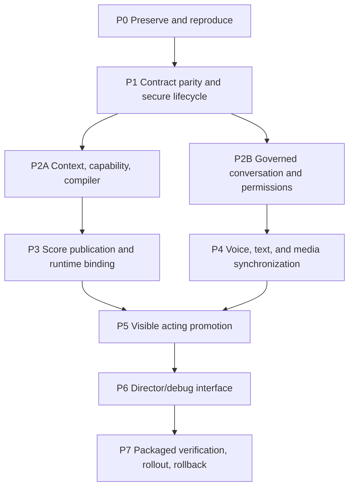

# Character Director Synthesis and Implementation Workflow

Date: 2026-07-15
Status: synthesis and execution plan; no implementation or production acceptance is claimed
Python repository: `/Users/paul/Documents/WizardJoeAsci/WizardJoeAvatar-python`
PrismGT repository: `/Users/paul/Documents/Codex/2026-06-28/jedisherpa-prism-geometry-talk-https-github/work/prism-geometry-talk-current`

## 1. Synthesis Decision

The existing Python visualizer, Media Session V1 receiver, deterministic score
runtime, PrismGT media sampler/relay, character package, and fixed-step frame hub
are the required foundation. They must be extended in place. No second animation
runtime, media clock, connector, or scheduler is permitted.

Production release is currently **HOLD**. The source-level foundation is strong,
but the complete Character Director is not implemented or verified. In
particular, the conversation bridge, production `PerformanceContext`, complete
capability contract, character-bound compiler, score-repository wiring,
permission-world propagation, aligned text/voice path, and production promotion
of the shadow acting work are missing or partial. The current shadow director is
diagnostic-only and must remain non-authoritative until its promotion gates pass.

The minimum published connector integration floor is:

- Python `408825ae75e395cd0761d0f17b9636a40559263a` (`fix: close local media animation audit`).
- PrismGT `59106015fe22b224df350ddd28dc2fd487132681` (`fix: make Wizard media connection trustworthy`).

The pinned anchors remain the historical baselines and regression targets:

- Python `556701a0dfd8c9c553de7159bc2d747b43fa9bd8`.
- PrismGT `189fbabc4f59af5d53e352c6bf9c692ee7382214`.

The Companion descendants are a separately gated pair, not part of the
published floor:

- Python `3927b8c`, `a91f27d`, and `293a2d8`.
- PrismGT `bf229c2`.

They may enter the candidate only after clean reconstruction, publication, and
paired discovery/packaging verification. A release manifest must bind the exact
full hashes used from both repositories.

## 2. Reconciled Current State

Status meanings in this synthesis:

- **Implemented**: present on a named production path or named commit with
  focused evidence.
- **Partial**: useful implementation exists, but an authority boundary,
  lifecycle, mapping, or required path is incomplete.
- **Missing**: no production implementation was found.
- **Unverified**: source or historical evidence exists, but the required clean,
  packaged, live, visual, long-running, or cross-repository proof is absent.

| Area | Reconciled status | Decision |
| --- | --- | --- |
| Python fixed-step runtime, frame hub, bounded viewer fanout, media acceptance | **Implemented** | Preserve `WizardFrameHub` as the single writer and `PerformanceApplication` as the only production mutation boundary. |
| Media Session V1 at the raw anchors | **Partial** end to end | Both halves exist, but raw anchors omit known activation, speech ownership, and acknowledgement corrections. Test them as baselines; do not use them as the implementation tip. |
| Media Session V1 at `408825a` / `5910601` | **Implemented in source; live pair unverified** | Use as the minimum floor, then prove clean cross-language and installed-app behavior. |
| Prism connector audio ownership | **Implemented on the integrated event path; partial API boundary** | Normal sampling is observational, but the anchored hook exports an unused `stopPlayback` method that can pause/seek media. Remove that connector-owned control surface before claiming the boundary is absolute. |
| Main HTML audio clock | **Implemented** | Keep Prism's audible media element authoritative; Python receipt-monotonic time is interpolation only. |
| Speech clock | **Partial** | Element-backed speech is observable. Web Audio, browser TTS, synthetic speech, `say`, and `afplay` bypass the connector clock and must be classified as unsynchronized until rerouted. |
| Mouth synchronization | **Partial** | Scheduler mouth state is media-time-derived, but the renderer can replace it with a simulation-time speaking loop. One final mouth authority is required. |
| Score contracts, loader, repository, scheduler | **Implemented as components** | Production construction does not inject a score resolver, so normal playback is scoreless. Wiring is **Missing**. |
| Character capabilities | **Partial** | 89 poses exist; 39 are graph-admitted and 50 are diagnostic-only. The graph is the best admission source, but no complete machine-readable capability manifest exists. |
| Transition, contact, interruption, phrase policy | **Partial** | Metadata and shadow primitives exist; production performs atomic target-pose changes and does not execute the full policy. |
| Stage, gaze, body mapping, reduced/still final application | **Partial; release-blocking** | Scheduler values exist, but several stop before `WizardState` or can be overwritten by fallback action selection. |
| Dance | **Partial contract; visible capability missing** | A score channel exists, but no admitted dance action/clip/application map exists. Do not call the music fallback a dance system. |
| Prism governed stage stream and `reply` release boundary | **Implemented in Prism** | Wizard receives none of it. The content-free conversation bridge is **Missing**. |
| Prism visual advisory receiver | **Implemented in Python; production transport missing** | Parser safety is not transport completion. Harden ingress and add a backend-held-token relay before use. |
| Conversation interruption | **Missing** | Local output stop and server-confirmed turn cancellation must be separate, inspectable outcomes. |
| Permission-world | **Missing/unverified** | Core types do not prove a live grant store or visual propagation. Keep permission visuals disabled until grant/deny/revoke provenance is real. |
| External-action approval freshness | **Partial; governance blocker** | Normal X UI sends a payload hash, but server freshness, mandatory binding, expiry, and one-time consumption are incomplete. |
| Durable memory approval provenance | **Partial; governance blocker** | Shape-valid caller assertions are not authenticated receipts; persona episodes/reflections bypass the core approval path. |
| Shadow acting/control/phrase work | **Implemented as dirty, tested observer components; production missing** | Preserve atomically, land behind the existing default-off shadow flag, and do not grant it mutation authority. |
| Clean baseline tests | **Verified by specialist runs** | Python anchor: 245 tests; Prism anchor: Node/Rust/build suites passed. These results do not verify the current dirty candidates. |
| Current dirty Python tests | **Verified only for that dirty snapshot** | 337 tests passed, including shadow work. This is migration evidence, not a release receipt. |
| Current packaged/live candidate | **Unverified** | Installed Companion predates current dirty work; the live port-8765 service is legacy and showed concerning long-run presentation data. |

### Explicit disagreement resolution

1. **Which PrismGT `HEAD` is current:** the Phase 0 record identifies the shared
   audited Prism worktree at `bf229c2`, one commit ahead of upstream and dirty.
   The production-verification report's clean `5910601` result refers to a clean
   connector verification checkout. Both observations are valid; neither makes
   `bf229c2` a published release floor.
2. **Whether the connector is fully implemented:** static and component tests
   support **implemented components**. Missing anchored activation, acknowledgement
   edge parity, browser deadlines, and installed main/speech/main proof keep the
   cross-repository release status **partial/unverified**.
3. **Whether speech synchronization is implemented:** it is implemented only for
   element-backed speech through the tracked `speechAudioRef`. Other audible
   fallbacks are outside the connector clock, so the product-wide claim remains
   **partial**.
4. **Whether mouth motion is implemented:** seven mouth states and deterministic
   fallback cycles are implemented. Alignment-driven, single-authority rendered
   synchronization is **partial/missing**, depending on the path.
5. **Whether the Character Director is implemented:** acting, ownership, phrase,
   contact, and replay primitives are implemented in current dirty shadow work.
   Production application is explicitly **missing** because tests prove the
   observer does not mutate avatar state.
6. **Whether old visual evidence is sufficient:** historical Rust and Python
   evidence remains useful format and reliability evidence, but it does not
   verify this Python/Companion/Prism candidate. Current visual acceptance is
   **unverified**.
7. **Whether governance is complete:** CDISS and media/advisory safety primitives
   are implemented for reviewed paths. Approval freshness, durable memory
   receipts, standing grants, permission-world propagation, and all-sink privacy
   are partial or missing and remain explicit blockers for those capabilities.

## 3. Locked Architecture and Extension Points

```mermaid
flowchart LR
    A["Prism governed turn and real media elements"] --> B["Prism same-origin local routes"]
    B --> C["Rust loopback relay with backend-held credentials"]
    C --> D["Python strict media and visual-advisory ingress"]
    D --> E["MediaSessionCoordinator.accept_with_result"]
    E --> F["PerformanceContextV1 builder"]
    F --> G["Character-bound compiler and CompiledScoreRepository"]
    G --> H["PerformanceScheduler absolute-time evaluation"]
    H --> I["PerformanceApplication guarded adapter"]
    I --> J["WizardAvatarController and ProceduralWizardFrameSource"]
    J --> K["WizardFrameHub shared encoded-frame fanout"]
```

The following are the only approved integration seams.

| Concern | Existing extension point | Required use |
| --- | --- | --- |
| Accepted media authority | `wizard_avatar.media_session.MediaSessionCoordinator.accept_with_result` | Build context only from an accepted active snapshot. Do not create a second media clock or place media snapshots in the ordered command inbox. |
| Context binding | New internal `PerformanceContextV1` beside existing compiler types | Bind runtime, connector session, source/media epoch, turn/evidence, character/package, score, motion profile, control lease, and reconciliation generation. This is proposed work, not an existing type. |
| Capability discovery | `wizard_avatar.character_package.load_character_package` and `animation_graph_path_for` | Keep the character package as discovery root; derive/cross-validate a structured manifest from graph, pose library, runtime mappings, and evidence. |
| Portable score assembly | `wizard_avatar.performance_compiler.assemble_performance_score` and `compile_baseline_performance` | Add deterministic intent-to-plan and portable-to-character-bound compilation here. Models may propose semantic intent only. |
| Durable score publication | `wizard_avatar.performance_score.CompiledScoreRepository` | Publish immutable validated generations and atomically update `current.json`; never mutate published scores in place. |
| Runtime score selection | `PerformanceScheduler.accept_snapshot`, `evaluate`, and `current_state` | Preserve pure absolute-media-time evaluation and accessibility/channel projection. |
| Production mutation | `wizard_avatar.performance_application.PerformanceApplication.apply` | Remain the sole guarded adapter into controller state. Reject stale context/reconciliation generations immediately before mutation. |
| Fixed-step orchestration | `wizard_avatar.stream.WizardFrameHub._reduce_runtime_tick` | Keep one writer and one 60 Hz semantic clock. Integration edits to this file are coordinator-owned only. |
| Shadow observation | `WizardFrameHub._observe_shadow_snapshot` and `WIZARD_PERFORMANCE_SHADOW_ENABLED` | Use for parity evidence only until explicit promotion; default remains off. |
| Final rendered mouth/gaze | `ProceduralWizardFrameSource._reference_mouth_shape`, `_reference_eye_aim`, and face overlay path | Consume the resolved production authority; do not introduce independent timers or silently drop accepted gaze. |
| Visual advisory application | `WizardAvatarController._cmd_prism_signal` and `semantic_animation.map_prism_signal` | Keep advisory-only, content-free, non-locomotion semantics; make status and TTL operational. |
| Python ingress | `wizard_avatar.server.create_app`, media-session routes, and `/api/avatar/wizard/prism-signal` | Reuse strict loopback, bearer, Origin, exact-JSON, and bounded-body controls for every Prism relay. |
| Prism media serialization | `media/mediaSessionProtocol.js` | Remain the browser privacy allowlist and Media Session V1 serializer/parser. |
| Prism media sampling | `media/useMediaSessionConnector.js::createMediaElementConnector` | Observe actual elements, publish full state, and never control playback. |
| Prism Rust relay | `crates/prism-cdiss-cli/src/media_connector.rs::MediaConnector`, `RelayQueue`, `send_once` | Preserve one in flight plus one latest pending, loopback pinning, bounded bodies/timeouts, and sanitized status. |
| Prism local routing | `crates/prism-cdiss-cli/src/web.rs::build_local_app_router` and Wizard route handlers | Add local-only visual advisory relay beside media routes; public web must omit it. Shared-file edits are coordinator-owned. |
| Governed stage source | `stream_governed_turn`, `stage_meta`, `stage_event` in Prism `web.rs` | Forward sanitized structured stages only. Server `queued/active`, not optimistic browser state, acknowledges receipt. |
| Final response release | Prism `reply` SSE handling in `index.jsx` | Gate response entrance on the matching `reply`; `ready/done` alone is insufficient. |
| Audible speech source | `speechAudioRef` and `playCdissAudioElement` | In synchronized mode, route audible reply bytes through the observable element. |
| Packaged configuration | Prism `src-tauri/src/main.rs` and Python Companion lifecycle | Load private configuration/discovery before relay startup; preserve literal loopback, credential separation, and fail-closed permissions. |

## 4. Clean Workspace and Dirty-Work Migration Strategy

No acceptance command may run in either shared dirty worktree. Shared worktrees
remain read-only preservation sources during implementation.

### 4.1 Preservation receipts

Before any migration, a provenance agent must create a read-only receipt for
each shared repository containing:

- absolute root, remote URLs, branch, full `HEAD`, upstream, and status;
- `git diff --binary` for tracked work and a SHA-256 inventory of untracked files;
- separate patch sets by concern, never one opaque omnibus patch;
- lockfile hashes, tool versions, and the full hashes of the pinned anchors and
  proposed floor commits;
- no credentials, process environments, raw discovery files, or private config
  contents.

The receipt is evidence only. It does not make dirty behavior releasable.

### 4.2 Isolated repository construction

1. Create a fresh clone of `jedisherpa/wizardjoeavatar` for verification of
   `556701a` and `408825a`. Fetch the local committed Companion descendants by
   full hash from the preserved local repository only after recording their
   object IDs.
2. Create a fresh clone of `jedisherpa/prism-geometry-talk`; do not create the
   release worktree from the damaged shared object store. Run `git fsck --full`
   before trusting ancestry or tag results.
3. Create proposed branches `codex/character-director-python` from `408825a`
   and `codex/character-director-prism` from `5910601`.
4. Keep detached clean baseline worktrees at `556701a` and `189fbab` for frozen
   regression runs. They are never implementation branches.
5. Bind every paired candidate in an integration manifest containing repository
   URLs, full hashes, Media Session schema/fixture hash, canonical connector
   document hash, and dirty-state `false` for both trees.

### 4.3 Migration ledger

| Existing work | Current classification | Migration rule |
| --- | --- | --- |
| Python committed connector remediation `408825a` | Valid published floor | Start from it. Do not reimplement or squash away its provenance. |
| Prism committed connector remediation `5910601` | Valid published floor | Start from it after fresh-clone integrity checks. |
| Python Companion chain through `293a2d8` | Implemented locally; clean/package pair unverified | Replay commits in order on a lifecycle branch, run clean package tests, and merge only with the matching Prism discovery descendant. |
| Prism Companion discovery `bf229c2` | Implemented locally; unpublished pair and full history unverified | Fetch by full hash into the fresh clone, inspect diff, test with the Python Companion chain, then publish/bind as one pair or leave out. |
| Python `performance_acting.py`, `performance_control.py`, `performance_phrases.py`, `performance_phrase_catalog.py`, `performance_shadow.py`, their six tests, and `stream.py` wiring | Valuable, tested dirty work; observer-only | Migrate as one atomic patch with imports, tests, flag, and diagnostics. The first clean commit must preserve flag-off behavior and non-mutation. Partial migration is forbidden. |
| Python Companion/browser viewport and presentation changes | Partial/unverified dirty work | Split into renderer queue/safe-area code, tests, and CSS/UI patches. Require pixel/canvas tests at canonical desktop/mobile sizes before merging. |
| Python close-up restoration under `work/` | Quarantined; 0 pass / 10 revise in the latest review | Preserve as evidence only. Do not copy into production definitions, graph admission, package manifest, or automatic selection. |
| Python animation-control and Character Director reports | Documentation evidence | Preserve independently from runtime commits; do not use their presence as implementation evidence. |
| Prism dirty connector/Rust/Tauri/UI edits | Unverified and mixed concern | Export per-file/per-hunk patches, replay onto the fresh candidate one concern at a time, and require focused tests after each patch. No wholesale worktree copy. |
| Prism dirty `ApprovalsDrawer.jsx` change | Governance-adjacent, unverified | Keep separate from connector migration; merge only with the approval freshness contract and negative tests. |

If a dirty patch cannot be cleanly attributed, explained, tested, and assigned an
owner, it remains quarantined. Nothing is discarded from the preservation
source, and nothing is silently promoted.

## 5. Multi-Agent Operating Model and File Ownership

Each agent works in its own branch/worktree. File ownership is exclusive within
a wave. Cross-owner changes are sent as a proposal or failing test; the listed
owner performs the edit. Only the integration coordinator resolves shared-file
conflicts.

| Agent | Exclusive implementation ownership | Must not edit |
| --- | --- | --- |
| A0 Lead integration coordinator | Integration manifests; final architecture/status docs; shared choke points `wizard_avatar/stream.py`, `wizard_avatar/server.py`, Prism `web.rs`, `index.jsx`, and `src-tauri/src/main.rs` after owner proposals | Character assets or specialized modules without owner review |
| A1 Provenance and migration | Preservation receipts, clean clones/worktrees, patch ledgers, commit-pair manifest | Runtime, tests, manifests, installed apps |
| A2 Contract parity | Python media schemas/fixtures/parser tests; Prism `mediaSessionProtocol.js` and tests; Rust protocol structs/parser tests in `media_connector.rs` | Scheduler, renderer, conversational UI |
| A3 Runtime/context/compiler | Proposed context module/schema; `performance_compiler.py`; `performance_score.py`; compiler/edit/replay tests | Renderer, Prism code, shared stream/server files |
| A4 Character capability | `character_package.py`, character-package/capability schemas, derived capability manifest tooling/tests | Pose cells or graph admission without animation review |
| A5 Scheduler/application | `performance_scheduler.py`, `performance_application.py`, score resolver construction tests | Frame renderer, Prism code, shared stream/server files |
| A6 Animation and acting | `performance_acting.py`, `performance_control.py`, `performance_phrases.py`, phrase catalog, `frame_source.py`, `controller.py`, animation integration tests | Connector contracts, Prism code, shared stream/server files |
| A7 Prism media transport | `useMediaSessionConnector.js`, connector diagnostics, focused hook tests; proposes Rust/shared-route changes to A0/A2 | Governed turn logic, approval/memory code |
| A8 Conversation experience | `PromptRow.jsx`, `StageRail.jsx`, message/reveal helpers, new focused conversation components/tests; proposes `index.jsx` changes to A0 | Media protocol, Python scheduler/renderer |
| A9 Governance and permissions | Prism approval, permission store, memory receipt/service modules and tests; Python advisory governance tests | Animation styling, media clock logic |
| A10 Voice and alignment | Alignment ingestion/compilation modules and tests; speech-element and progressive-text helpers; proposes shared frontend changes to A0 | Media authority or player controls |
| A11 Director/debug interface | New internal director components, score-edit client, diagnostics views and tests after APIs stabilize | Core scheduler/compiler behavior |
| A12 Production verification | Orchestrator, evidence schema validation, fault injection, metrics, recorder, privacy scan, packaging/rollback test harnesses | Production behavior except instrumentation approved by the owning agent |
| A13 Independent visual reviewers | Scored reviews and admission decisions only | Runtime, assets, tests, or evidence generation |

Additional ownership rules:

- A0 is the only agent allowed to modify a shared choke-point file in the
  integration branch.
- A2 owns any cross-language contract change across both repositories so fields
  cannot drift between agents.
- A6 may propose pose admission, but A13 must independently approve visual and
  motion evidence before A4 changes admission status.
- A12 must verify commits it did not author. The producing agent cannot be the
  sole acceptance reviewer.

## 6. Dependency Graph and Implementation Waves

### Phase P0 - Preserve, repair, and reproduce

**Dependencies:** none.
**Parallel waves:** P0.1 Python baseline; P0.2 fresh Prism clone/integrity; P0.3
dirty-work preservation.

1. Produce preservation receipts and concern-separated patch bundles.
2. Reproduce `556701a`, `408825a`, `189fbab`, and `5910601` in clean checkouts.
3. Run frozen baseline suites before migration.
4. Run `git fsck --full` in the fresh Prism clone and repeat exact ancestry/tag
   checks. Do not attempt repair in the shared damaged checkout.
5. Create the first paired integration manifest.

**GO:** both baselines and both floor commits resolve by full hash; clean baseline
commands pass; fresh Prism object integrity passes; dirty work is preserved and
hash-inventoried.
**STOP:** missing object, unexplained patch, dirty candidate, weakened test, or
unresolved provenance.

### Phase P1 - Contract parity, activation, and secure lifecycle

**Dependencies:** P0.
**Parallel waves:** parity vectors can be authored while activation tests are
written, but protocol implementation changes are serialized by A2.

#### P1.1 Test-first parity

1. Publish one canonical V1 snapshot/ack fixture set with a recorded hash.
2. Add negative vectors for duplicate top-level/nested keys, unknown fields,
   integer maxima, `error.code`, `max_snapshot_hz`, every disposition, content
   type, body/ack limits, privacy keys, stale cursors, and runtime rotation.
3. Make Python, JavaScript, and Rust report the same accept/reject result and
   stable error code for every vector.
4. Correct acknowledgement handling without lying about accepted cursors:
   accepted dispositions require submitted identity equality; control/error
   dispositions may report the prior accepted watermark and must still reach
   `handleAck`.

#### P1.2 Connector ownership and reliability

1. Remove connector-owned `stopPlayback`; player commands remain in the player.
2. Fix preference-change sampling, `rate_milli` diagnostics, truthful failure
   states, and browser fetch deadline/cancellation.
3. Preserve one in flight plus one latest pending at both browser and Rust hops.
4. Test terminal speech/main reclaim through queue saturation.

#### P1.3 Activation and ingress security

1. Verify a private mode-0600 token/config path and packaged launcher loading.
2. Enforce literal-loopback bind, client, Host, no-browser-Origin, separate app
   and media credentials, exact JSON, and bounded bodies in every mode.
3. Make frame-hub failure visible in health and supervisor policy.
4. Select and document one canonical lifecycle; if Companion is selected, add a
   reversible legacy coexistence/migration path.

**GO:** cross-language parity is byte/error-code exact; raw anchors still pass
their frozen tests; the floor pair passes all connector tests/builds; security
and activation negative tests pass; no connector API controls audio.
**STOP:** any language accepts a vector another rejects, any token appears in
browser/log evidence, loopback is configuration-only, or reconnect requires
reload/manual intervention.

### Phase P2A - Context, capability manifest, and compiler

**Dependencies:** P1 wire contract frozen.
**Parallel waves:** capability derivation and context schema may proceed in
parallel; compiler starts only after both freeze.

#### P2A.1 `PerformanceContextV1`

Write failing tests, then add a frozen typed internal context and strict schema.
It must bind accepted connector/session/source identity, media clock, runtime
epoch, reconciliation generation, score/character/package identities, control
authority, motion/accessibility preferences, governed turn state, and
content-free evidence fingerprints. It must reject floats, unknown fields,
stale bindings, and private content. It must not expand Media Session V1.

#### P2A.2 Capability manifest

Derive a versioned manifest from the character package, 28-clip graph, 89-pose
library, runtime enums, application mappings, and evidence digests. It must make
the 39 admitted versus 50 diagnostic-only distinction executable. Each
capability records exact IDs, facings, channels, entry/exit/interrupt rules,
speech/locomotion compatibility, whole-pose versus independently compositable
ownership, props/effects, fallback, quality tier, provenance, and evidence.

#### P2A.3 Character-bound compiler and edits

1. Normalize semantic intents; no model or Prism event may choose pose/clip IDs.
2. Resolve exact capability, declared fallbacks, characterful neutral, then
   still/clear with explicit fallback records.
3. Compile into the existing `CompiledPerformanceScoreV1`; do not create a
   second runtime artifact.
4. Compile phrase instances into absolute timed cues so linear play, cold seek,
   reconnect, and restart are equivalent.
5. Implement immutable `ScoreEditsV1` application, old-value preconditions,
   locks, conflict reporting, deterministic rebase, recompilation, and atomic
   publication.

**GO:** same inputs produce byte-identical context, plan, score, and hashes;
every selected capability is admitted and mapped or has an explicit fallback;
a deliberately smaller test character works without Wizard-specific runtime
branches; cold/linear equivalence passes.
**STOP:** render-time capability guessing, silent tier-C admission, history-only
phrase evaluation, mutable published score, or private text in context/evidence.

### Phase P2B - Governed conversation, approvals, and permission state

**Dependencies:** P1 secure relay pattern.
**Parallel waves:** Python advisory status/TTL; Prism stage relay; approval/memory
hardening. Shared Prism files remain serialized through A0.

#### P2B.1 Hardened visual advisory path

1. Protect `/api/avatar/wizard/prism-signal` with the media route's loopback,
   bearer, Origin, exact-JSON, and body-bound principles.
2. Add a local-only Rust relay using backend-held credentials; public web has no
   route.
3. Generate source epoch, monotonic sequence, event ID, TTL, and an allowlisted
   content-free payload. Never forward prompt, reply, stage labels, summaries,
   errors, model/provider data, paths, hashes, authority, or commands.
4. Make `completed`, `cancelled`, `failed`, and expiry release or transition the
   advisory instead of replaying it.

#### P2B.2 Truthful turn lifecycle and interruption

1. Acknowledge only server `queued/active`.
2. Map sanitized stage IDs and `active -> active`, `done -> completed`.
3. Gate final entrance on the matching `reply`, not `ready/done`.
4. Enter audible speaking only on actual speech-element `playing`.
5. Add a visible stop-response control and cancel stream read, reveal, TTS
   fetch, element audio, browser speech, Web Audio, and synthetic animation.
6. Add server-correlated cancellation. Until confirmation, report `output
   stopped`, never `turn cancelled`; discard late replies.

#### P2B.3 Governance prerequisites

1. Make external-action approval ID/hash/route/ledger/turn binding mandatory,
   server-minted, expiring, supersedable, and atomically one-time.
2. Replace caller-asserted durable memory approval with mutation-bound,
   ledger-verified, expiring, one-time receipts.
3. Route explicit notes, episodes, reflections, and backstory through one memory
   mutation service with secret filtering and explicit external-embedding consent.
4. Wire a canonical permission store into production readiness, including
   scope, purpose, grant time, expiry, surfaces, denial, revocation, and ledger
   identity.
5. Emit only content-free permission posture to Wizard. Permission visuals
   never grant permission.

**GO:** success, clarification, waiting approval, error, output stop, and
confirmed cancellation have end-to-end tests; stale/replayed approvals and
memory receipts fail closed; grant/deny/revoke reaches a truthful visual posture
without authority leakage.
**STOP:** optimistic acknowledgment animates Wizard, `reply` can arrive after a
claimed cancellation, raw error/content crosses the relay, or visual state can
manufacture a permission.

### Phase P3 - Score repository and runtime binding

**Dependencies:** P2A context/compiler.
**Parallel waves:** repository I/O tests and mechanical application mapping.

1. Establish one app-owned score root and inject a fail-closed resolver into
   `PerformanceApplication` construction.
2. Perform cold load, digest, package, media, transcript, and alignment checks
   off the tick-critical section; atomically publish validated immutable score
   objects to the scheduler.
3. Recheck context hash and reconciliation generation immediately before
   `PerformanceApplication.apply`.
4. Bound replay retention by time/bytes, retain dropped counters and rolling
   checkpoint hash, and export full evidence only to explicit artifacts.
5. Replace scoreless runtime guesses with named migration fallbacks and explicit
   records. Preserve behavior until parity evidence allows removal.

**GO:** matching score load, scoreless fallback, mismatch, stale revision,
corrupt pointer/generation, restart persistence, crash-before/after-pointer, and
nonblocking cold load tests pass.
**STOP:** valid bindings silently fall back, score I/O runs on the render tick,
replay grows without bound, or stale compiled work mutates current state.

### Phase P4 - Voice, text, and animation synchronization

**Dependencies:** P1 reliable connector, P2B turn lifecycle, P3 score binding.

1. In synchronized mode, route audible generated speech through the observable
   speech element. Keep Web Audio/browser TTS/direct speaker paths explicitly
   degraded unless they gain an actual sampled clock.
2. Produce canonical `AlignmentV1` from provider timing or the approved local
   aligner, preserving word/punctuation/silence units and exact media/transcript
   hashes.
3. Compile mouth, silence, and progressive-text tracks from that artifact.
4. Make final rendering consume `state.mouth` when media performance owns mouth;
   remove the simulation-time override for that case.
5. Use the same active media element clock for text, mouth, face, gaze, gesture,
   locomotion, and narrative cues. Heuristic reveal is labelled degraded and is
   not counted as synchronized evidence.
6. Expose sanitized source, freshness, accepted clock error, hard-reconcile
   reason, rendered media position, and cue error diagnostics.

**GO:** the full source/lifecycle/rate/recovery/alignment matrix meets the timing
budgets in Section 8; silence closes the rendered mouth; warm, seek, reconnect,
and cold reconstruction produce identical rendered mouth/frame hashes.
**STOP:** audible output bypasses the claimed clock, text leads without timing
evidence, or scheduler and final renderer disagree.

### Phase P5 - Visible acting and accessibility promotion

**Dependencies:** P2A capability compiler, P3 guarded application, P4 one clock.

#### P5.1 Final-state invariants

1. Apply or explicitly suppress stage position, body mapping, and gaze with a
   stable reason code.
2. Make `full`, `reduced`, and `still` authoritative after all fallbacks.
3. Normalize expression/gaze/mouth vocabularies.
4. Prove user control leases retain root/body authority.

#### P5.2 Narrow phrase promotion

1. Keep the full shadow coordinator non-authoritative.
2. Promote only the admitted `idle_front`, `explain_front`, and `walk_front`
   phrase path behind a proposed product-level mode gate after parity tests.
3. Execute minimum holds, markers, commit/recovery, legal successors, and
   contact correction while preserving atomic pose snapshots.
4. Add deterministic recent-phrase history and intentional still holds. Do not
   rotate large scoreless music actions every 500 ms.
5. Do not admit close-ups, diagnostic-only poses, dance, independent props, or
   unsupported vertical gaze without separate evidence and manifest changes.

#### P5.3 Expansion

Expand one capability family at a time only after the prior family has current
visual, continuity, accessibility, interruption, and soak evidence. Asset
existence never implies admission.

**GO:** final state and pixels prove stage/gaze/body/mouth mapping, all four
interrupt policies, contact limits, repetition rules, and reduced/still
invariants at desktop/mobile sizes; independent animation review approves the
promoted phrases.
**STOP:** scheduler-only evidence, one-frame root/scale/shadow jumps, mouth clock
divergence, accessibility leakage, random cycling, or quarantined asset use.

### Phase P6 - Character Director API and internal director/debug tool

**Dependencies:** stable P2-P5 contracts and ownership.

1. Version an API over existing remote-control, media, score, and state surfaces;
   do not duplicate existing commands. Pause, resume, stop, and seek requests
   must route to Prism's existing player-owned APIs; the connector observes the
   resulting full media state and never becomes a playback controller.
2. Support session lifecycle, character/scene selection, pipeline stage,
   validated score load, waiting/speaking, semantic intent, gaze/stage/facing,
   admitted gestures, pause/resume/seek observation, cancel/interrupt/reset,
   capability/state query, recording, and replay.
3. Build the internal tool against that API: character and score load, stage
   simulation, stage path/gaze/emotion, speech/text preview, interruption,
   permission simulation, viewport resize, cue inspection/edit/disable/replace,
   immutable save, and deterministic replay.
4. Display only sanitized connector/session/turn/media time, sync error, active
   cue, animation, position, gaze, expression, upcoming count, queue depth,
   fallbacks, rejections, and score/manifest versions.
5. Simulation modes are visibly marked and cannot be mistaken for live Prism
   state or real permission.
6. The final architecture handoff must include separate diagrams for context
   flow, observable pipeline stages, compiler stages, score validation and
   publication, text/TTS alignment, runtime scheduling, connector transport,
   permission-world propagation, interruption/cancellation, and the director
   debugging surface. Each diagram must name the real modules and authority
   boundaries implemented by the accepted commits.

**GO:** every command is versioned, authenticated, bounded, validated, and
replayable; editor preview and published playback share the same compiled score
hash; no simulation can enter production evidence.
**STOP:** UI-side score mutation, direct pose IDs from an untrusted producer,
duplicate control APIs, or unsanitized diagnostics.

### Phase P7 - Packaged verification, rollout, and rollback

**Dependencies:** all preceding phase gates.

1. Run clean Python 3.9 compatibility and packaged CPython 3.12.10 builds.
2. Run full Python, Companion, Prism Node/Rust/workspace/build suites from the
   exact paired commits.
3. Execute 30-minute controlled and two-hour packaged soaks with declared limits.
4. Run the complete failure matrix, visual review package, privacy canaries,
   clean packaged launch, lifecycle migration, and isolated rollback/reinstall.
5. Finalize evidence manifest and checksums only after every artifact passes.

**GO:** every objective deliverable has a retained artifact and passing row in
Section 12; both candidate trees are clean and published/bound; independent
review signs the acceptance matrix.
**STOP:** placeholder evidence, skipped required test, dirty provenance, stale
installed bundle, privacy leak, unexecuted rollback, or any release blocker
still marked partial/missing/unverified.

## 7. Test-First Gate Policy

Every behavior change follows this order:

1. Add a failing test or captured current-behavior fixture.
2. Run the frozen baseline to distinguish intended change from regression.
3. Implement in the exclusive owner branch.
4. Run focused tests, then repository full suite.
5. Merge only after A12 reproduces the result in a clean candidate.
6. Run paired and packaged gates when the change crosses a process/repository
   boundary.
7. Update status only from retained evidence. A green unit suite cannot upgrade
   a live, visual, packaged, governance, or endurance status by itself.

| Gate | Required test classes |
| --- | --- |
| G0 Baseline | Exact-anchor and floor clean suites; ancestry; lock hashes; no changed frozen fixture |
| G1 Contracts | Golden and negative parity vectors in Python/JS/Rust; stable errors; privacy; bounds; cursor semantics |
| G2 Context/compiler | Schema/hash determinism; capability/fallback; stale binding; second-character fixture; edit/rebase/publication |
| G3 Conversation/governance | Stage/reply order; status/TTL; auth; output stop versus turn cancel; approval/memory receipt; grant/revoke |
| G4 Synchronization | Source/lifecycle/rate/recovery/alignment matrix; rendered output, not scheduler state only |
| G5 Acting | Stage/gaze/body/mouth final application; phrase phases; contacts; interrupt policies; repetition; accessibility |
| G6 Resilience | Queue floods; dropped/duplicate/reordered data; process kills; timeout/HTTP faults; corrupt discovery; disk/path failure |
| G7 Endurance | Rolling cadence, event-loop lag, RSS/FD/thread/queue growth, replay bound, media/presentation drift |
| G8 Visual | Required cases, views, sizes, frame-step review, independent scores and correction reruns |
| G9 Packaging | From-zero install/build, clean provenance, resource inventory, signature, isolated launch orders, shutdown |
| G10 Rollback | Isolated install/failure/rollback/reinstall with unchanged legacy service and Prism installation |

## 8. Quality and Performance Metrics

Thresholds already established by the reports are hard gates unless a documented
pre-run decision tightens them. New memory and review thresholds must be approved
before data is observed; post hoc thresholds are forbidden.

| Metric | Acceptance target |
| --- | --- |
| In-process renderer | p95 <= 33.3 ms; p99 <= 41.7 ms for the existing medium/24 fps benchmark |
| Simulation cadence | 59.9-60.1 Hz over the 600-second acceptance run |
| Presentation cadence | 23.9-24.1 FPS over the 600-second acceptance run, plus rolling-window compliance in 30-minute and 2-hour runs |
| Command latency | p95 <= 100 ms under concurrent-viewer soak |
| Browser sample to Python ACK | p95 <= 25 ms; p99 <= 50 ms |
| Visible cue to audible media | p95 absolute error <= 50 ms; maximum <= 100 ms at every supported rate |
| Seek | no stale pre-seek cue after acceptance; target error <= 100 ms; stable cue <= 250 ms after seek completion |
| Reconnect | accepted reconnect <= 2 s; active-source position within 100 ms <= 500 ms after acceptance |
| Rates | 0.5x, 0.75x, 1.0x, 1.25x, 1.5x, and 2.0x all pass sync gates |
| Queues | Declared finite capacities; zero sequence regression/decode corruption; eventual latest-state convergence; release events never dropped |
| Replay | Bounded response size/time and process retention; rolling hash continuity and explicit dropped-record counters |
| Memory/resources | No monotonic post-warmup RSS slope and no unbounded FD/thread/queue growth under a numeric limit approved before the run |
| Stage containment | Complete character, shadow, staff, wings, and active effect inside safe area at `1280x720` and `390x844` |
| Contact | At most one cell correction in a tick and zero corrected planted-contact drift until release |
| Facing | No more than one of the existing eight facing sectors per simulation tick |
| Mouth/silence | Rendered mouth equals selected authority; pause/silence closes within one simulation tick |
| Repetition | With multiple eligible phrases, no phrase more than twice consecutively; with one, use intentional still holds |
| Still mode | Root, stage position, altitude, facing, pose, clip, and node remain constant except explicit user takeover; only face/eyes/gaze/blink/mouth/speech may change |
| Reduced mode | No prohibited channel leaks through fallback action selection; retained gestures keep root fixed and use admitted restrained mappings |
| Progressive text | When called synchronized, p95 <= 50 ms and max <= 100 ms against canonical word boundaries; heuristic reveal is excluded |
| Privacy | Zero canary occurrences outside authorized stores; zero token/path/prompt/transcript/provider leakage in payloads, logs, diagnostics, evidence, or crash output |

## 9. Visual and Performance Review

Each case must be recorded from the real paired candidate at full speed and with
a frame/state trace. Representative cases also require slow motion and
frame-by-frame review.

Required cases:

1. Application launch and user arrival.
2. Short and long responses.
3. Long model delay and long TTS delay.
4. Interrupted and cancelled responses, separately.
5. Serious, humorous, emotionally warm, and explanatory responses.
6. Audiobook storytelling with play, pause, seek, rate change, and speech
   preemption/restoration.
7. Low-energy and high-energy music; label the result a fallback until an
   admitted dance capability exists.
8. Permission request, denial, grant, expiry, and revocation.
9. Reduced-motion and still modes.
10. Connector failure, Python restart, Prism restart, reconnect, and stale
    session rejection.
11. Manual locomotion during compatible speech/face performance.
12. Text-only success, missing alignment, and voice-generation failure.

Review viewports and framings:

- `1280x720` desktop and `390x844` mobile, plus supported portrait/landscape
  resize transitions and high-DPI checks;
- full-body and medium views for every promoted phrase;
- close-up only where the current admitted art supports it; quarantined close-up
  assets are excluded;
- real time, slow motion, frame-by-frame, and synchronized audio/frame trace.

Two independent reviewers score 1-5 for gaze precision, blink timing,
head-eye coordination, hand preparation/stroke/hold/recovery, hand arcs, foot
contact, starts/stops/turns, stage composition, emotional continuity,
stillness, repetition, text-voice sync, truthful system representation,
interruption quality, silhouette/readability, and character appeal. Proposed
acceptance is median >= 4, no item below 3, and no unresolved truthfulness,
accessibility, contact, or synchronization blocker. This threshold must be
approved before the first acceptance review.

Every failed item produces a named correction, owner, before/after evidence,
and complete rerun of the affected sequence. A still image, scheduler hash, or
component test is never motion acceptance.

## 10. Evidence Artifact Contract

Each run writes under a proposed immutable root:

`evidence/character-director/<UTC-run-id>/`

Required contents:

| Path | Contents |
| --- | --- |
| `manifest.json` | Both repository URLs/full hashes/branches, clean flags, baseline/floor hashes, schema/fixture/doc hashes, tool versions, OS, feature modes, seeds, commands, exit codes, artifact digests, waivers, and final status |
| `provenance/` | Redacted refs, ancestry, lock hashes, package/graph/pose digests, sidecar provenance, bundle identity |
| `contracts/` | Canonical bytes/hash, language parity results, negative-vector dispositions |
| `tests/` | Separate stdout/stderr, totals, skips/filters, durations, full/focused suite receipts |
| `compiler/` | Context, intent, plan, portable score, edit set, compiled score, publication, fallback/suppression, and replay hashes without private content |
| `integration/` | Sanitized main/speech/main, stage/reply, permission, interruption, queue, and failure traces |
| `timing/` | Browser samples, ACKs, Python estimates, cue/presented times, drift distributions, seek/reconnect measurements |
| `performance/` | Benchmark, rolling FPS, event-loop lag, RSS/peak RSS, CPU, FD/thread/queue metrics, replay bounds |
| `visual/` | MP4s, frame sequences, contact sheets, frame/state hashes, review scorecards, corrections |
| `package/` | Build provenance, resource inventory, executable/bundle hashes, signature, isolated launch/shutdown matrix |
| `rollback/` | Pre-state, executed actions, post-state, unchanged legacy/Prism proof, reinstall hash/result |
| `privacy/` | Canary definitions by hash, allowlist, scan result, zero-leak assertion; never raw secrets |
| `SHA256SUMS` | Generated and verified last, after all content is final |

The orchestrator fails closed on a dirty tree, placeholder, missing artifact,
nonzero required command, skipped required test, checksum mismatch, or canary
leak. Raw `launchctl print`, process environments, Authorization headers,
private discovery/config contents, copyrighted media, and private conversation
text are forbidden evidence.

## 11. Rollout and Rollback

### Rollout stages

1. **Off:** existing production scheduler/application only. This is the rollback
   behavior.
2. **Shadow:** existing default-off `WIZARD_PERFORMANCE_SHADOW_ENABLED` observer
   produces bounded comparison diagnostics and no avatar mutation.
3. **Candidate canary:** a proposed product-level mode gate enables only the
   three admitted phrases for explicitly selected local QA sessions. The gate
   name and contract must be added and documented during implementation; it is
   not claimed to exist now.
4. **Limited production:** admitted Character Director score path is enabled for
   a declared subset of modes while scoreless legacy fallback remains available.
5. **Default on:** only after all objective rows pass, rollback is exercised,
   and no required mode depends on a missing/unverified capability.

At every stage, unknown context, stale binding, expired advisory, connector
loss, capability mismatch, score failure, or queue uncertainty releases
performance-owned channels and returns to the documented safe legacy/listening
state. It never retries by controlling audio or substituting an unrelated pose.

### Rollback triggers

- timing, cadence, memory, privacy, governance, accessibility, contact, or
  truthfulness gate violation;
- stale turn or session mutates rendered state;
- installed candidate cannot prove its paired commits;
- unexpected permission/world object persists after revoke;
- connector or app cannot return to main media without restart;
- feature-off output differs from the frozen legacy parity fixture.

### Rollback procedure

1. Disable the candidate mode and conversation/permission advisory relay while
   leaving Media Session V1 and Prism audio untouched.
2. Restore the last accepted paired manifest and immutable compiled-score
   pointer; do not mutate or delete prior generations.
3. In the isolated QA namespace, stop only the app-owned Companion child,
   remove only its owned discovery/data, and restore the prior QA bundle.
4. Verify the legacy port-8765 service, installed Prism app, main audio, user
   data, approvals, and unrelated processes are unchanged.
5. Verify no child, listener, login item, stale discovery, or permission-world
   object remains from the rejected candidate.
6. Reinstall the accepted candidate and prove artifact hashes and launch result
   are reproducible.

No rollback uses `git reset`, generic process killing, shared app replacement,
or deletion of the preserved dirty worktrees.

## 12. Objective Deliverable Acceptance Matrix

| # | Objective deliverable | Current status | Required owner/gate and acceptance evidence |
| ---: | --- | --- | --- |
| 1 | Baseline and Provenance Report | **Implemented** by Phase 0 and specialist 02; Prism broad history **partially unverified** due damaged object store | A1/G0: fresh-clone `fsck`, repeated containment, exact floor choice, paired manifest |
| 2 | Connector Documentation Audit | **Implemented as a report** by specialist 03; live claims **unverified** | A2/A7/G1: every matrix row updated only from exact commits and installed proof |
| 3 | Current-State Architecture Report | **Implemented across specialist reports; packaged/live details partial** | A0/G0/G9: final diagrams and runtime traces bound to accepted commits |
| 4 | Independent Specialist Reports | **Implemented**: ten independent reports exist | A0: preserve reports unchanged and record this synthesis as the single reconciliation round |
| 5 | Final Architecture | **Missing as an implemented final system** | A0 with all owners/G2-G6: diagrams plus actual module/API/contracts and status-qualified implementation map |
| 6 | Character Capability Manifest | **Missing as a complete contract** | A4/G2/G5: generated/cross-validated machine file, exact admission/fallback/evidence, second-character test |
| 7 | Performance Context Schema | **Missing** | A3/G2: typed `PerformanceContextV1`, strict schema/examples, hash/stale/privacy tests |
| 8 | Performance-Score Schema | **Implemented at V1; character-bound production compiler/edit application partial/missing** | A3/G2-G3: preserve V1, add compiler/edit/publication/replay proof and examples |
| 9 | Buffer-Space Performance Library | **Missing end to end; Prism stages and Python receiver exist separately** | A8/A9/A6/G3/G5: observed-stage library with entry/hold/timeout/interrupt/reduced behavior and installed traces |
| 10 | Context-to-Performance Compiler | **Partial portable baseline; character-bound compiler missing** | A3/A4/G2: deterministic intent-plan-resolution-compiled score with explicit fallbacks |
| 11 | Text, Voice, and Animation Synchronization | **Partial** | A10/A5/A6/G4: element-clocked speech, AlignmentV1, text/mouth tracks, rate/seek/reconnect drift evidence |
| 12 | Completed PrismGT Connector | **Partial in source; installed completion unverified** | A2/A7/A0/G1/G3/G4/G9: parity, activation, stage relay, reliability, main/speech/main and fault proof |
| 13 | Director and Debug Tool | **Missing** | A11/G6: usable internal interface over versioned APIs with immutable edit/replay and sanitized diagnostics |
| 14 | Automated Test Suite | **Partial; strong component coverage, missing clean cross-system matrix** | A12/G0-G7: clean full suites, parity, governance, failure, endurance, and package receipts |
| 15 | Visual Review Package | **Missing for current Python candidate** | A12/A13/G8: synchronized recordings/screenshots/traces/scorecards/corrections at required cases and sizes |
| 16 | Reproducible Setup Documentation | **Partial** | A0/A12/G9: exact clean environment, dependency/build/start order, config, paths, troubleshooting, migration, and rollback commands |
| 17 | Production-Readiness Report | **Missing for a final candidate** | A0/A12/G10: every item classified implemented/verified/partial/blocked/deferred/dependency, paired commits, limitations, rollback, and direct completion verdict |

No row may be marked complete merely because its schema, test helper, planning
document, or one repository half exists. The acceptance row must cite the exact
clean commit pair and retained artifact digest.

### Required mode coverage

| Required mode | Current status | Acceptance dependency |
| --- | --- | --- |
| Conversational performance | **Partial components; bridge/interruption missing** | P2B stage/reply/cancellation path, P4 speech clock, P5 visible behavior, installed trace |
| Buffer-space performance | **Missing end to end** | Only observable Prism stages, bounded stage library, timeout/error/cancel/reduced variants, no fabricated progress |
| Directed performance | **Partial low-level controls; compiled direction missing** | P2A intent-plan-capability-score compiler and P6 API/tool; unsupported intent must reject/fallback explicitly |
| Audiobook performance | **Implemented foundation; production score binding and full verification partial** | P3 score resolver, P4 alignment/sync, play/pause/seek/rate/reconnect and main/speech/main evidence |
| Music performance | **Partial score analysis/fallback; admitted dance missing** | Deterministic beat/section compilation may ship only with admitted character mappings; otherwise status remains deferred/missing-assets |
| Permission-world | **Missing/unverified** | P2B canonical permission store and grant/deny/revoke/expiry propagation; visual state carries no authority |
| Small-screen/device | **Partial dirty viewport work; clean proof unverified** | Migrated safe-area renderer tests and recordings across desktop/mobile/orientation/high-DPI resize |
| Cross-surface continuity | **Architecture-only beyond current local surfaces** | Implement only repository-supported surfaces; any future surface requires explicit linking, scoped memory/permission, revocation, provenance, and stale-session tests |

## 13. Program Stop/Go Gates

| Decision point | GO only when | STOP/HOLD when |
| --- | --- | --- |
| Begin implementation | P0 preservation, clean baselines, fresh Prism integrity, floor pair recorded | Shared dirty tree is the only source, or provenance is ambiguous |
| Change a wire contract | Cross-language failing vectors and one contract owner exist | Language implementations are edited independently |
| Merge dirty work | Atomic concern patch passes flag-off/parity and focused/full clean tests | Patch is mixed, unattributed, partially copied, or changes default authority |
| Enable conversation bridge | Authenticated relay, status/TTL release, reply gate, and privacy tests pass | Browser talks directly to Wizard, raw content crosses, or optimistic state drives animation |
| Enable permission-world | Canonical grant store and deny/revoke/expiry provenance pass | Permission is inferred from persona, memory, pending count, or animation |
| Bind compiled scores | Repository, context, stale-binding, crash, and nonblocking-load gates pass | Runtime silently falls back on a valid but unloadable binding |
| Promote shadow behavior | Absolute-time equivalence, final pixels, accessibility, contacts, interruption, and review pass | Evidence is scheduler-only, old, dirty, or diagnostic-only |
| Build release package | Both repos are clean/published/bound and all source gates pass | Dirty provenance, stale resources, or unmatched Companion pair |
| Install/canary | Isolated package launch, privacy, failure, visual, and 30-minute soak pass | Legacy service/app would be replaced or evidence is incomplete |
| Default on | Two-hour soak, rollback/reinstall, all 17 deliverables, and independent sign-off pass | Any blocker is partial, missing, unverified, waived after the run, or described as implemented without evidence |

The goal is fully achieved only after the final gate passes. Until then the
direct status is **partially achieved, production blocked**, with each missing or
unverified capability named in the acceptance matrix rather than implied by
planned work.

