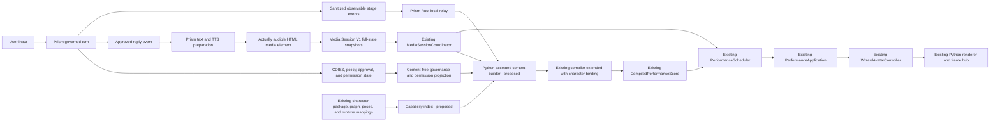
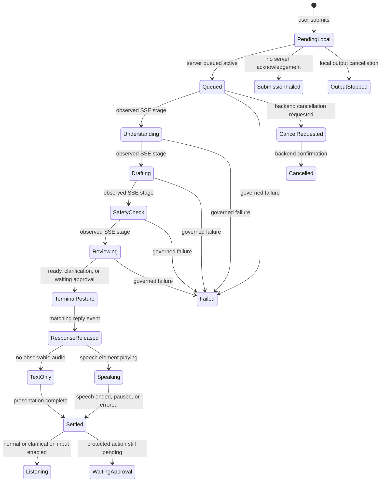
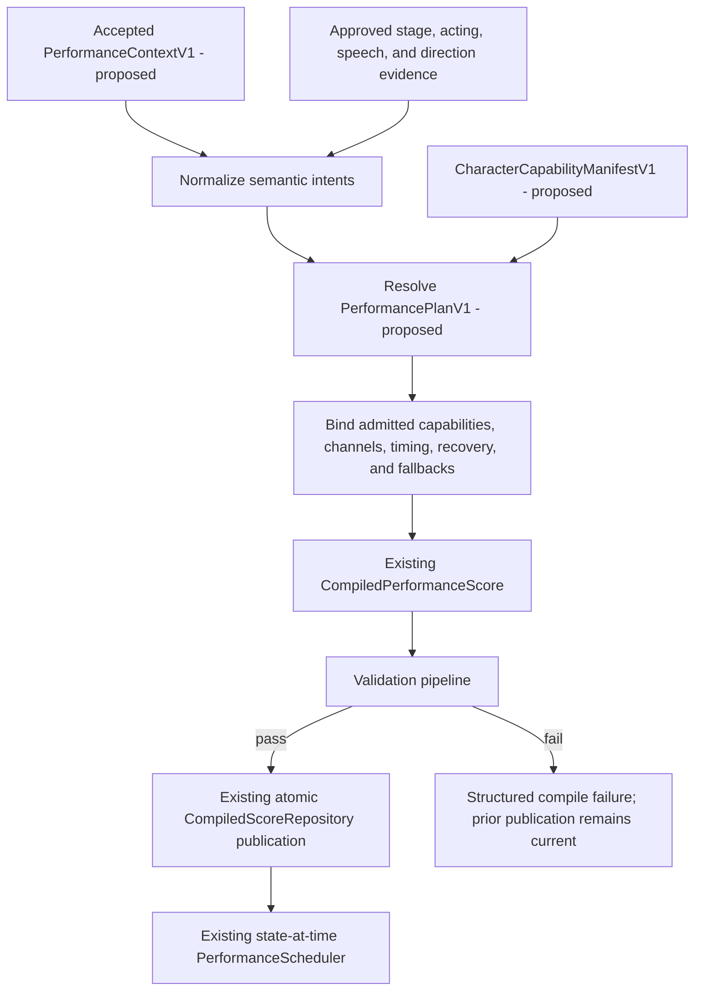
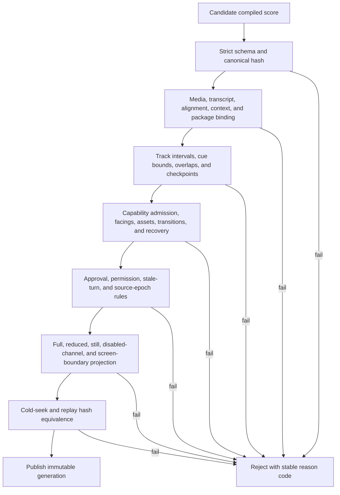
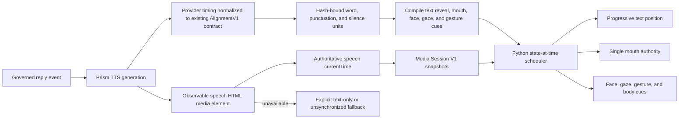
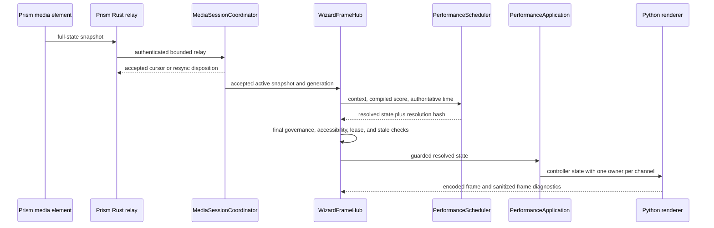
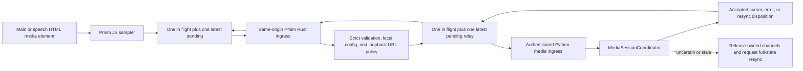
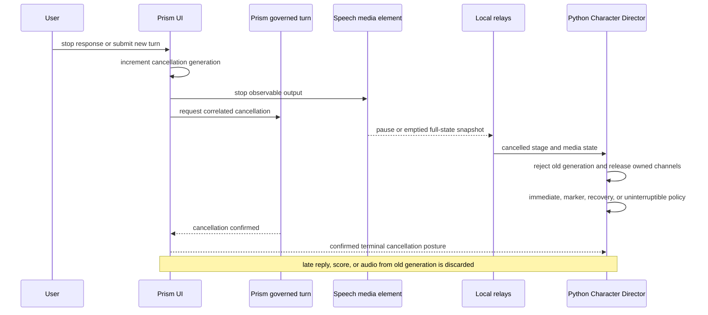
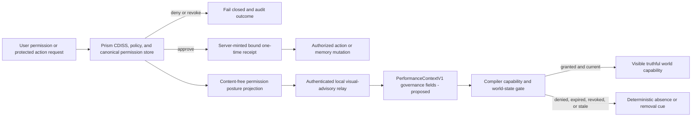
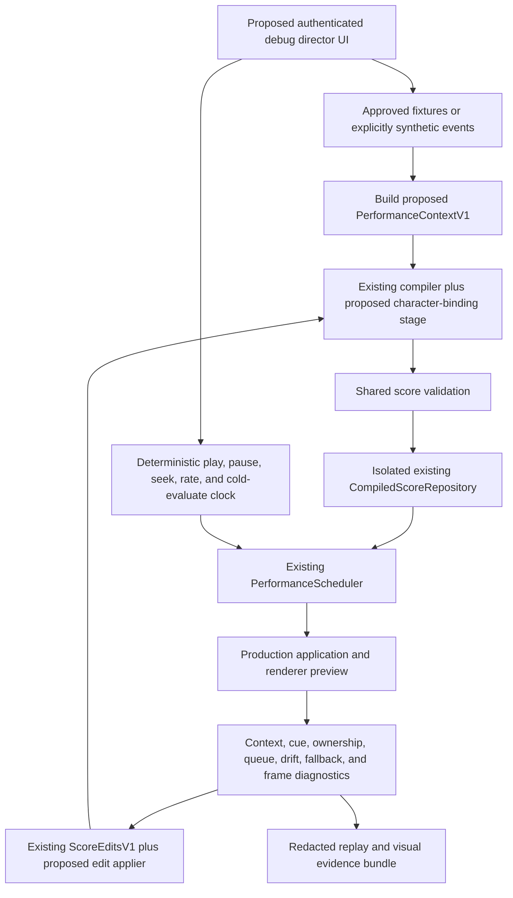

# Character Director Final Synthesis and Architecture

Date: 2026-07-15

Scope: architecture synthesis only. This document does not change runtime code,
tests, manifests, prior reports, or generated evidence.

Evidence base:

- pinned objective and authority order;
- `00-phase0-workspace-record.md`;
- independent specialist reports `01` through `10`;
- Python performance anchor `556701a0dfd8c9c553de7159bc2d747b43fa9bd8`;
- Prism connector anchor `189fbabc4f59af5d53e352c6bf9c692ee7382214`;
- current canonical connector document
  `docs/audiobook-performance/LOCAL_PRISMGT_AUDIO_CONNECTOR.md`.

## 1. Executive decision

The Character Director must extend the existing Python performance engine and
the existing Prism media connector. It must not become a parallel animation
runtime, a second media clock, or choreography hosted in Prism.

The selected minimum published integration floor is:

| Repository | Historical anchor | Selected published floor | Decision |
| --- | --- | --- | --- |
| Python Wizard Joe | `556701a` | `408825ae75e395cd0761d0f17b9636a40559263a` | Preserve the anchor as the feature floor; begin integration from its published direct remediation, which fixes speech/main ownership and installed connector activation. |
| PrismGT | `189fbab` | `59106015fe22b224df350ddd28dc2fd487132681` | Preserve the anchor as the relay floor; begin integration from its published direct remediation, which fixes packaged configuration, acknowledgement handling, and visible connector status. |

The raw anchors remain mandatory regression baselines. They are not the chosen
implementation tips because the reports agree that they contain known paired
activation, speech handoff, and acknowledgement defects.

Later Companion work is a migration candidate, not part of this selected floor:

- Python `3927b8c` plus local packaging descendants `a91f27d0` and `293a2d8`;
- Prism `bf229c2` for Companion discovery and monotonic speech-clock work.

That later pair may replace the legacy fixed-port lifecycle only after both
sides are published, cleanly reproducible, cross-pinned, packaged, and pass the
same connector, synchronization, privacy, launch, and rollback gates. It must
not be adopted one side at a time.

The current Character Director candidate is **partial** and **not production
accepted**. Its acting, channel-ownership, phrase, contact, interruption, and
replay primitives are real and tested in the current worktree, but they are
uncommitted, default-off, and explicitly shadow-only. The production path still
uses `PerformanceScheduler` and `PerformanceApplication`, and several resolved
channels do not reach rendered pixels.

## 2. Status discipline

This synthesis uses the following words strictly:

- **Implemented:** present on the named production or candidate path, with the
  evidence stated here.
- **Partial:** a real implementation exists, but authority, coverage, lifecycle,
  application, or release integration is incomplete.
- **Missing:** no production path was found for the required behavior.
- **Unverified:** source or tests exist, but the required clean, live, visual,
  installed, long-running, or cross-repository proof was not produced.
- **Proposed:** an architecture element defined by this synthesis and not an
  existing module, class, endpoint, or artifact.

Passing component tests does not promote a partial or unverified behavior to
implemented end to end. A scheduler value that never reaches controller state
or pixels is partial. A packaged app built before the candidate is not evidence
for the candidate.

## 3. Reconciled evidence ledger

| Area | Current status | Evidence-grounded conclusion |
| --- | --- | --- |
| Python fixed-step runtime | **Implemented** | One Uvicorn process, one event loop, one `WizardFrameHub`, 60 Hz semantic clock, shared frame fanout, ordered commands, and bounded subscriber queues are the correct production topology. |
| Prism Media Session V1 | **Implemented/partial** | Strict two-hop browser -> Rust -> Python snapshots, authentication, body bounds, source identity, and media-time estimation exist. Raw anchors have activation, paused-speech, and control-ACK defects corrected by the selected published floor. Edge-schema parity and live proof remain incomplete. |
| Compiled score contracts/repository | **Implemented** | Versioned portable and compiled score models, strict loaders, immutable generations, and atomic publication exist. |
| Compiled score production loading | **Missing** | Normal `PerformanceApplication` construction supplies no score resolver, so production commonly falls back to scoreless behavior. |
| Character-bound compiler | **Missing/partial** | Portable narrative score construction exists; no production compiler was found that resolves the portable score against the actual admitted character capabilities into `CompiledPerformanceScore`. |
| Character capability truth | **Partial** | Package, graph, pose library, enums, mappings, and evidence exist, but no single complete structured manifest exists. Of 89 loadable poses, only 39 are graph-admitted clip samples; 50 remain diagnostic-only. |
| Production staging/gaze/body mapping | **Partial** | The scheduler resolves stage, gaze, and body mapping values, but `PerformanceApplication` does not apply all of them. |
| Expressions/blink/mouth primitives | **Implemented/partial** | Ten expressions, deterministic blink, and seven mouth shapes render. Score-driven gaze is not applied, and speaking can replace media-time mouth state with a simulation-time loop. |
| Locomotion/flight | **Implemented/partial** | Deterministic movement, bounds, facing, pathing, and admitted clips exist. Contact locking, graph interrupt policy, and full directional authored coverage are incomplete. |
| Dance | **Missing visibly** | A scheduler channel and scoreless action cycle exist; no admitted dance capability or application mapping exists. |
| Reduced/still motion | **Partial, release-blocking** | Scheduler projection exists, but final action resolution can reintroduce body motion. It is not yet a rendered-boundary invariant. |
| Acting/phrase director | **Partial** | Typed current-worktree primitives and 73 focused passing tests exist, but the path is uncommitted, disabled by default, history-based, and non-mutating. |
| Conversational stage observation | **Implemented in Prism, missing end to end** | Prism emits truthful governed SSE stages and Python accepts strict content-free advisories. No authenticated Prism-to-Wizard conversation relay connects them. |
| Final response entrance | **Partial** | Prism has a governed `reply` release event and a real speech element path, but neither drives a complete Wizard conversation lifecycle. |
| Progressive text/voice sync | **Missing for exact sync** | Reply reveal uses heuristic token timing. Provider alignment is not delivered to the live scheduler. |
| Main audiobook clock | **Implemented** | The real main HTML audio element is authoritative; Python only interpolates briefly after accepted snapshots. |
| Audible speech clock | **Partial** | Element-backed speech is observable; Web Audio, browser speech, synthetic speech, `say`, Piper/`afplay`, and similar fallbacks bypass the connector clock. |
| Interruption | **Partial/missing** | Media handoff and user control lease release are sound. Normal UI output stop, backend-confirmed turn cancellation, stale reply rejection, and rendered recovery are missing. |
| Governance primitives | **Implemented/partial** | CDISS/action routing and visual advisory restrictions are substantial. Stale external approvals, caller-asserted memory approvals, and persona-memory bypasses remain unresolved. |
| Permission world | **Missing/unverified** | No canonical production permission store is wired through to a truthful visible-world projection. |
| Observability | **Partial** | Diagnostics and counters exist, but structured lifecycle logs, task failure state, clock error, rendered sync error, bounded replay retention, and long-run metrics are incomplete. |
| Debug director | **Missing** | Existing diagnostics are useful, but no unified internal inspect/edit/replay director exists. |
| Packaging | **Partial/unverified** | Legacy LaunchAgent and Companion sources exist. Current Candidate Companion launch, clean packaging, resource inventory, installed pairing, and rollback are unverified. |
| Production acceptance | **Blocked** | Clean paired candidate, production promotion, visual proof, long-duration drift/memory proof, packaged launch, rollback, and redacted evidence bundle are absent. |

## 4. Reconciled disagreements and binding decisions

### 4.1 Raw anchors versus descendant fixes

The objective names `556701a` and `189fbab` as concrete anchors. The provenance,
connector, and timing reports agree that direct published descendants contain
required corrections. The binding decision is to keep the anchors as the
published capability floor and regression target, while selecting
`408825a`/`5910601` as the minimum implementation floor. No report may relabel
descendant behavior as implemented at the anchors.

### 4.2 Existing compiler versus missing compiler

`performance_compiler.py` exists and can create deterministic portable baseline
scores. The compiled score schema and loader also exist. The missing element is
the character-bound stage that resolves semantic requirements against admitted
Wizard Joe capabilities and emits a fully bound `CompiledPerformanceScore`.
Therefore the compiler is **implemented for portable baseline authoring** and
**missing for production character binding**.

### 4.3 Shadow director promotion

The acting and phrase reports value the current shadow work; the compiler and
verification reports reject promoting it directly. Both are correct. Its typed
events, ownership claims, phrase phases, contacts, and interruption policies are
inputs to the future compiler. Its stateful coordinator is not a second
scheduler. It remains observational until phrase instances compile into the
existing score and absolute media-time evaluation matches linear and cold-seek
results.

### 4.4 Python versus Rust animation authority

Rust evidence demonstrates valuable asset and transition review, but the current
product decision makes Python/ASCILINE the production renderer. Rust manifests
are evidence inputs only. Prism Rust owns local relay/security/status; it does
not own pose selection, score execution, or character state.

### 4.5 Graph transitions versus visible transitions

The animation graph contains transitions, markers, holds, contacts, and policies,
but production presentation changes whole-pose snapshots atomically. Generic
cell dissolves create invalid anatomy. The selected design keeps atomic pose
graphs and implements choreography around them: preparation, marker-gated swap,
root/contact correction, hold, release, and recovery.

### 4.6 Response readiness versus response release

`ready`, `needs_clarification`, and `waiting_approval` describe governed terminal
posture; they do not prove that response content reached the client. The `reply`
SSE event is the presentation-release boundary. Audible speaking begins only on
the actual speech element's `playing` event. `waiting_approval` is not approval
to execute an action.

### 4.7 Objective context breadth versus connector privacy

The objective asks for conversational, approval, timing, permission, display,
and character context. The connector contract forbids prompt, reply, transcript,
path, URL, and secret content. The resolution is a least-authority context:
Prism retains private language and produces approved semantic/timing artifacts;
Python receives opaque identity, hashes, allowlisted semantic intent, approval
posture, timing, and capability constraints. Raw text is present only where text
display or TTS generation requires it, never in media heartbeat or animation
advisory messages.

### 4.8 Connector observation versus playback control

The normal connector path is observational, but the baseline hook exports a
`stopPlayback` method that pauses and seeks main audio. That API is rejected.
Player-owned controls change audio; connector handlers report the resulting full
state. Reconnect, retry, and interruption must never restart, pause, or seek main
media on their own.

## 5. Ownership architecture

### Python owns

- accepted connector/session/runtime epochs and stale-state rejection;
- active main/speech source reconciliation after a validated snapshot;
- `PerformanceContextV1` construction and hashing (proposed contract);
- character package discovery and capability admission;
- semantic intent normalization, plan resolution, score compilation, validation,
  publication, scheduling, and fallback records;
- state-at-authoritative-time evaluation;
- channel arbitration, accessibility projection, and direct-control leases;
- mechanical application to `WizardAvatarController`;
- character state, rendering, frame encoding, replay hashes, and sanitized
  runtime diagnostics.

### Prism JavaScript owns

- the real main and speech HTML media elements and their current playback state;
- sampling full-state media snapshots from those elements;
- governed SSE stage observation and user-facing text presentation;
- local output controls, including future stop-response UI;
- same-origin browser calls only. It never receives the Wizard bearer secret.

### Prism Rust owns

- local-only same-origin connector ingress;
- private configuration/discovery resolution;
- loopback destination validation and bearer attachment;
- bounded relay, timeout, retry disposition, and sanitized connector status;
- proposed content-free conversation advisory relay;
- backend-confirmed governed-turn cancellation and approval receipt issuance
  where Prism governance is authoritative.

### Shared versioned contracts

- existing `MediaSessionSnapshotV1` and `MediaSessionAckV1`;
- existing portable and compiled performance score schemas;
- existing strict Prism visual advisory schema;
- proposed `PerformanceContextV1` and `CharacterCapabilityManifestV1`, internal
  to Python unless a deliberately smaller projection is published;
- one hash-bound cross-language fixture set for every connector field that is
  duplicated in Python, JavaScript, and Rust.

Prism may request bounded semantic intent. A model may propose semantic intent
or `no_decision`. Neither Prism nor a model may select pose IDs, clip IDs,
channel ownership, timing authority, or permission outcomes.

## 6. Target context flow

## 7. Typed contract architecture

### 7.1 `PerformanceContextV1` - proposed contract

This is a proposed symbol, not an existing class or module. The preferred
location is a proposed `wizard_avatar/performance_context.py`, or an equivalent
type colocated with the existing compiler if repository maintainers prefer not
to add a module.

The model is immutable, versioned, canonically encoded, hashable without floats,
and built only after the authoritative source snapshot or governed event is
accepted. It contains:

| Group | Required fields and rules |
| --- | --- |
| Runtime | Wizard runtime epoch, simulation tick, reconciliation generation, context creation monotonic time. |
| Source | Connector session ID, snapshot/event ID, accepted sequence, media epoch, source slot, source epoch, turn ID, utterance ID. Do not invent `sequence + 1`. |
| Clock | Authoritative media position, playback state, rate in milli-units, snapshot age, freshness, hard-reconcile reason. |
| Conversation | Allowlisted intent, tone, sensitivity, urgency, humor/uncertainty bands, relational stance, and response artifact identity. Raw prompt/reply is not carried over animation or media relay. |
| Pipeline | Observed stage, mapped status, stage start, expected next event only when explicitly exposed, cancellation/error posture, TTS readiness, alignment readiness. |
| Approval | `unapproved`, `approved_for_presentation`, or `denied`; presentation artifact digest; pending action posture kept distinct from response presentation approval. |
| Character | Character ID, package/manifest digest, runtime API version, current pose/action/position/facing/gaze/expression/world state, recent bounded performance summary. |
| Display | Width, height, scale factor, orientation, safe areas, caption area, normalized stage bounds. |
| Governance | Allowed/denied semantic actions, pending approval references, memory scope, external-action posture, notification scope, linked-surface state. Never include bearer tokens or authority-bearing receipts in render context. |
| Preferences | Full/reduced/still profile, intensity bands, disabled channels, caption mode, progressive-reveal preference, voice preference. |
| Control | User locomotion lease identity and expiry, manual override state, channel claims, cancellation generation. |
| Evidence | Ordered content-free fingerprints, source commit/schema versions, score/package bindings, no transcript or private content. |
| Hash | `context_sha256`, calculated over canonical content excluding the hash field. |

The compiler consumes a context snapshot. The runtime rechecks its context hash,
runtime epoch, source epoch, turn ID, package digest, and reconciliation
generation immediately before applying a result. Any mismatch yields `stale`
and releases only performance-owned channels.

### 7.2 `CharacterCapabilityManifestV1` - proposed contract

This is proposed. It should be discovered from the existing
`wizard_joe_character_package.json`, which remains the sole package entry point.
The manifest is generated or cross-validated from existing package, graph, pose,
expression, mouth, semantic mapping, runtime enum/application, and evidence
sources. It is not a second hand-maintained capability list.

Each capability record includes:

- stable capability ID, category, semantic meaning, emotional/energy range;
- admitted implementation mapping to action, clip, node, pose, expression,
  mouth, gaze, locomotion, flight, effect, prop, or whole-pose ownership;
- authored duration/fps, loop behavior, facing and stage requirements;
- legal entry/exit, markers, minimum hold, interrupt/commit/recovery policy;
- compatible speech, locomotion, face, gesture, prop, and effect channels;
- full/reduced/still behavior and disabled-channel behavior;
- fallback intent/capability and stable reason code;
- admission tier, quality status, provenance, evidence digest, and content hashes;
- renderer/runtime/schema compatibility and preload/memory/frame-cost budget.

Asset existence is not admission. Tier C and quarantined poses fail compilation
unless a reviewed promotion changes their graph status and evidence. Staff and
wings are declared `whole_pose` until region-addressable art and compositing are
actually implemented. Dance remains unsupported.

### 7.3 Existing performance-score contracts

The target reuses and extends the existing `PerformanceScore`,
`CompiledPerformanceScore`, `ScoreCue`, loader, and repository. It does not add
a parallel runtime score format.

Every compiled cue must carry or resolve:

- cue ID, turn/media session ID, start/end, track, semantic intent;
- requested capability and selected admitted mapping/clip/node;
- parameters, priority, owned channels, blend/atomic-swap policy;
- interruption policy, commit marker, recovery path, legal successor;
- required permission and required presentation approval;
- motion-profile behavior, fallback path, suppression records, confidence;
- source/provenance, context hash, package digest, mapping-policy version;
- notes that contain no private prompt, reply, transcript, URL, or local path.

The score surface supports the objective's required tracks without implying that
each is currently visibly implemented: pipeline/status, emotional state,
locomotion, stage position, facing, whole-body pose, gaze, eyes/blink, face,
hands/arms, speech, mouth, text reveal, breathing, dance, effects, world state,
permission posture, interruption, and manual override. The capability manifest
and application map decide which tracks are admitted for a character. A legal
schema track with no production mapping, such as current dance, is **missing as
visible capability**, not silently accepted.

Edits use the existing `ScoreEditsV1` contract. The missing edit applier must
enforce immutable base hashes, old-value preconditions, locks, explicit
conflicts, complete revalidation, recompilation, and atomic publication. No UI
may mutate a published score in place.

### 7.4 Character Director API boundary

The API extends existing remote-control and media-session surfaces; it does not
duplicate existing commands. Existing low-level controller commands remain for
manual operation and tests. New high- and mid-level direction enters as typed
semantic intent, compiles to a score, and reaches the controller only through
the normal scheduler/application path.

The versioned API groups are:

- session: begin/end, select character/scene, bind turn/media/context, reset;
- direction: submit high-level intent, submit a constrained performance plan,
  or submit validated low-level score cues;
- performance: load/publish score, play, pause, resume, seek, interrupt, cancel,
  and replay;
- bounded manual control: gaze, stage target, facing, admitted gesture, and
  user locomotion lease, using existing commands where they already exist;
- query: capability manifest, current context/state, active score/cues,
  connector health, ownership, fallbacks, and diagnostics;
- evidence: start/stop a redacted recording and export a bounded replay
  manifest.

High-level requests never bypass capability resolution. Mid-level requests are
clamped to normalized geometry, legal transitions, active speech, governance,
permissions, accessibility, and control leases. Low-level requests must already
name admitted capabilities and still pass score validation. Unsupported input
returns a typed rejection or declared fallback; it never silently selects an
unrelated animation.

## 8. Truthful stage director

The stage director is a compiler input and score library, not an elapsed-time
guessing engine. It may perform only stages Prism actually exposes.

| Prism observable | Truthful Character Director meaning | Current state |
| --- | --- | --- |
| server `queued/active` | Request accepted and waiting/entering serialized processing | Prism **implemented**; Wizard relay **missing** |
| `understanding/active` | Prism began prompt/context observation | Prism **implemented**; bridge **missing** |
| `drafting/active` | Provider is drafting unapproved text | Prism **implemented**; bridge **missing** |
| `checking_safety/active` | Auditor is checking the draft | Prism **implemented**; bridge **missing** |
| `reviewing/active` | Synthesizer is finalizing the governed result | Prism **implemented**; bridge **missing** |
| terminal `ready`, `needs_clarification`, `waiting_approval` | Outcome posture only; not yet response release | Prism **implemented** |
| matching `reply` | Approved response may enter presentation | Prism **implemented**; Wizard entrance **missing** |
| speech element `playing` | Audible speaking begins | Media connector **implemented** for element speech |
| speech pause/end/error | Audible speaking ends; restore latest main or settle | **Implemented/partial**, selected floor required |
| confirmed cancel | Governed work stopped and cannot later mutate/present | **Missing** |

Every stage library entry defines entry, stable hold, maximum hold before a
deterministic variation, repetition budget, completion/cancellation/failure
exit, timeout posture, interruption behavior, and reduced/still equivalents.
Status language is optional and must be allowlisted. No progress percentages,
source counts, hidden reasoning, or claims of near-completion are inferred.

### Pipeline-stage flow

## 9. Deterministic compiler

The compiler extends existing `performance_compiler.py`. Proposed helper types
may be colocated there; names in this subsection that do not already exist are
proposed.

1. **Normalize intent.** Convert approved semantic direction, stage events,
   acting evidence, speech/alignment evidence, direct-control claims, and
   requested phrase IDs into immutable `PerformanceIntentV1` records
   (proposed). Sort by source epoch, sequence, event time, priority, and stable
   ID. Reject conflicting duplicate IDs.
2. **Resolve a plan.** `PerformancePlanV1` (proposed) selects only admitted
   capability records, using exact match, authored fallback order, characterful
   neutral, then still/clear. It records every suppression and fallback.
3. **Compile.** Emit the existing `CompiledPerformanceScore` shape with absolute
   times, phrase phases, markers, contacts, recovery, channels, checkpoints,
   preload assets, and context/package bindings.
4. **Validate and publish.** Run schema, global track, capability, transition,
   accessibility, governance, screen-boundary, cold-checkpoint, and hash checks.
   Publish only through the existing atomic `CompiledScoreRepository`.
5. **Schedule.** The existing `PerformanceScheduler` evaluates the immutable
   score at authoritative time. It does not resolve new capabilities at runtime.
6. **Apply.** `PerformanceApplication` becomes a guarded mechanical adapter. It
   applies every admitted resolved field or emits a stable suppression/failure;
   it does not guess Wizard-specific actions.

### Performance compiler flow

### Score validation flow

Phrase primitives are retained, but phrase instances compile to absolute score
cues. The stateful `PhraseExecutor` remains a validator/parity oracle until it
can reconstruct the same phrase state from score plus context at any media time.

Music direction uses deterministic tempo, beat, energy, section, transition,
drop, breakdown, and ending artifacts. An LLM may propose section-level semantic
intent but does not generate beat timing. Until an admitted dance capability and
application mapping exist, music compilation selects only declared restrained
actions/effects or stillness and records `dance_unsupported`; it does not relabel
the current 500 ms action rotation as dance.

## 10. Authoritative text, voice, and media timing

Clock precedence is binding:

1. The `currentTime` of the actually audible speech HTML media element.
2. Otherwise, the `currentTime` of the main HTML media element.
3. Python receipt-time monotonic interpolation for no more than the existing
   1.5 second freshness window after an accepted playing snapshot.
4. A held or released safe state when freshness expires.

`sampled_at_monotonic_ms` is not subtracted across processes without a measured
clock-offset protocol. The Python 60 Hz simulation clock is never the media
clock. Heartbeat frequency cannot repair an unobserved audio path.

When synchronized mode is enabled, Prism routes synthesized reply bytes through
the observable speech media element. Web Audio, browser speech synthesis,
synthetic motion, `say`, Piper/`afplay`, and direct speaker paths are explicitly
`unsynchronized` fallbacks until they expose the clock of the object producing
sound. They may preserve output, but they cannot drive claims of synchronized
speaking.

Provider timing is normalized into the existing alignment artifact contract,
bound to exact media and transcript hashes, and compiled into word, punctuation,
silence, progressive-text, and mouth cues. Coarse VTT is a declared fallback.
Heuristic token reveal is decorative/degraded, not synchronized.

There is one final mouth authority. When media performance owns mouth state, the
renderer consumes the scheduler-selected mouth value and does not replace it
with a simulation-time speaking loop. Silence closes the mouth within one
simulation tick of an accepted state transition.

Release timing gates are:

| Measurement | Required gate |
| --- | --- |
| Browser sample to Python acknowledgement | p95 <= 25 ms; p99 <= 50 ms |
| Visible cue versus audible media position | p95 absolute error <= 50 ms; maximum <= 100 ms at every supported rate |
| Seek | no stale pre-seek cue after acceptance; target error <= 100 ms; stable cue <= 250 ms after seek completion |
| Reconnect | accepted reconnect <= 2 seconds; active-source position within 100 ms <= 500 ms after acceptance |
| Equal-time replay | linear, cold seek, reconnect, restart, rate change, and speech/main handoff produce the same resolved and rendered mouth/cue hashes |

These are live cross-process and final-render measurements. Scheduler-only unit
tests cannot satisfy them.

### Text and TTS alignment flow

## 11. Runtime scheduling and rendered truth

The existing `WizardFrameHub` remains the single writer. Media snapshots remain
outside the 1,024-item ordered user-command inbox because they are full-state
reconciliation, not imperative commands.

The final application order is:

1. accept and reconcile the full-state source snapshot;
2. build/reuse the context and verify score binding;
3. evaluate the compiled score at authoritative media time;
4. project governance, full/reduced/still, disabled channels, and user control;
5. recheck context generation immediately before mutation;
6. apply every supported resolved channel once;
7. atomically select whole-pose art and apply independent admitted overlays;
8. render, encode, publish, and record bounded sanitized evidence.

Accessibility is a final-state invariant. `still` may alter only speech/mouth,
face, eyes, gaze, and blink; root, stage, altitude, facing, pose, clip, node,
flight, effects, and camera remain fixed unless the user takes control. `reduced`
suppresses prohibited movement through the application and rendered frame, not
only in scheduler diagnostics.

Stage position, body mapping, and gaze are either visibly applied or rejected
with a stable suppression reason. A resolved field that silently disappears is
a runtime defect. Unsupported vertical/referential gaze is mapped to the
admitted left/center/right grammar or explicitly suppressed.

### Runtime scheduling flow

## 12. Connector transport and backpressure

The connector remains two-hop and local-only:

- Browser to Prism Rust: same-origin route, no Wizard secret.
- Prism Rust to Python: explicit literal-loopback HTTP, bearer token, no proxy,
  no redirects, strict JSON and body/response limits.
- Python acknowledgement: distinguishes submitted message identity from accepted
  cursor identity for control dispositions; stale/resync responses must reach
  the client recovery handler.

Both browser transport and Rust relay retain at most one in-flight snapshot and
one latest pending full-state snapshot. Coalescing is preferable to replaying
stale lifecycle samples, but required release/terminal state must eventually
converge. Browser fetch gets a deadline just above Rust's relay deadline.

Python retains bounded command, subscriber, deduplication, event/evidence, edit,
and diagnostic queues. Existing unbounded replay and shadow-history structures
must gain explicit byte/count/time budgets, dropped counters, rolling hashes,
and epoch-local pruning. Queue overflow never drops the only required release;
uncertainty releases performance-owned channels and requests full resync.

### Connector transport flow

## 13. Interruption architecture

Interruption has two separately named outcomes:

- **Output stopped:** local reveal, TTS request, speech media, browser speech,
  Web Audio, and synthetic animation have actually stopped.
- **Turn cancelled:** Prism confirms that governed work stopped and cannot later
  mutate conversation state, persist, emit, or present a reply.

A new turn increments a cancellation generation immediately. Any late compile,
score, event, reply, audio start, or application result with the old turn/source
generation is stale and rejected. Performance-owned speech, gesture, stage, and
world cues release. Physical continuity uses the authored interruption policy:
immediate before commitment where allowed, marker-gated, recovery after commit,
or uninterruptible completion. User locomotion remains authoritative.

### Interruption flow

Until backend confirmation exists, the UI says output stopped, not turn
cancelled. Disconnecting SSE is not cancellation because the inspected server
uses detached work and ignores failed event sends.

## 14. Governance and permission world

The character visualizes authority; it never creates authority.

1. Prism governance decides presentation approval, action approval, memory
   mutation, and permission state.
2. Material approvals become server-minted, one-time, expiring receipts bound to
   payload hash, route, ledger thread, turn, user, policy/constitution, and exact
   mutation. Caller-constructed shapes are not receipts.
3. A canonical permission store records grant, denial, scope, purpose, surface,
   issued/expiry times, provenance, and revocation. Denial/revocation wins over
   saved grants.
4. Python receives a content-free projection: capability kind, posture, scope
   class, expiry class, and source epoch. It never receives authority tokens,
   route payloads, memory content, paths, or secrets.
5. The compiler admits world objects/effects only when the current projection
   authorizes them. Revocation compiles or triggers a deterministic removal cue;
   stale events cannot preserve a capability.
6. Permission requests use plain functional consequences. No distress,
   dependence, abandonment, anger, disappearance, or coercion is permitted.

Current gaps are release-blocking for permission-world claims: stale external
approvals are not fail closed; core memory approval objects are caller-asserted;
persona episodes/reflections bypass the core receipt path; standing grants are
not wired into production; and no end-to-end world projection exists.

Cross-surface continuity is deferred architecture, not a current implementation
claim. Every future surface requires explicit linking, a scoped and inspectable
memory identity, per-surface permission, provenance, expiry, revocation, and
stale-session rejection. No device or application is correlated from animation,
media identity, or persona similarity. The context carries only the currently
linked surface posture that Prism can prove.

### Permission-world flow

## 15. Observability and privacy

Production observability is structured, bounded, and content-free by default.

Required events and metrics:

- pipeline stage transitions and their observed source/status;
- connector lifecycle, submitted and accepted cursor, retry/coalesce/drop counts;
- source slot, media freshness, hard-reconcile reason, accepted clock error;
- command and cue dispatch latency, event-loop lag, queue depth/age;
- active cue, selected capability, fallback/suppression reason, ownership;
- authoritative media time, scheduler cue time, presented-frame time, and drift;
- frame simulation/presentation rolling rates, overruns, encoding cost;
- interruption generation and release/recovery result;
- score load/publication, context/score/package hashes, not private contents;
- permission decision posture and expiry class, not receipt or grant body;
- task state and sanitized first-failure reason;
- RSS, peak RSS, CPU, descriptors, threads, and bounded-retention counters.

`/api/companion/health` must not report ready after a previously running frame
task fails. Health distinguishes starting, idle, ready, degraded, and shutting
down, and render-ready requires a produced frame.

Production logs never retain connector tokens, authorization headers, raw
process environments, prompt/reply/transcript text, provider payloads, titles,
URLs, local paths, permission receipts, or raw embedding errors. Debug mode may
show richer local state behind explicit access controls, but uses the same
redaction and retention rules. Evidence capture uses allowlists; raw
`launchctl print` is prohibited.

## 16. Debug director

The internal director is **proposed and currently missing**. A proposed module
name is `wizard_avatar/director_debug.py`; a proposed internal UI may live under
an explicitly non-public, authenticated Companion/debug surface. These names do
not describe existing files.

The debug director operates through the same context, compiler, repository,
scheduler, and application APIs as production. It does not mutate controller
state through a privileged parallel path.

It supports:

- select character, scene, display geometry, and motion profile;
- load approved conversation fixture, media, alignment, portable score, or
  compiled score;
- simulate allowlisted pipeline, permission, clock, fault, and interruption
  events with clearly marked synthetic provenance;
- author high/mid/low-level intent, stage paths, gaze, emotion, and gestures;
- inspect context, plan, cues, ownership, fallbacks, hashes, and queue state;
- apply immutable edits, select a take, recompile, validate, and atomically
  publish to an isolated debug repository;
- scrub, pause, seek, change rate, cold-evaluate, compare replay hashes, and
  record redacted evidence;
- never impersonate a real governed event in production logs or status.

### Debugging flow

## 17. Packaging and lifecycle policy

The selected floor preserves the supported legacy integration until Companion
is accepted as a pair.

### Legacy floor

- fixed Python listener at literal loopback `127.0.0.1:8765`;
- private high-entropy connector token provisioned to both sides;
- source-tree LaunchAgent lifecycle remains supported only if installer
  preflights interpreter/dependencies and verifies versioned health;
- non-loopback binding is rejected at startup and connector ingress in every
  mode, not just Companion mode.

### Companion migration candidate

- packaged PyInstaller sidecar, dynamic literal-loopback port, separate app and
  media credentials, private discovery, bounded restart, app-owned logs, and
  graceful shutdown are the desired canonical lifecycle;
- adoption requires the corresponding published Prism discovery support;
- build must start from a clean commit and reject conflict-copy resources;
- provenance binds source commit, dirty state false, lock hashes, executable
  hash, Python/runtime versions, and both repository integration hashes;
- QA launches under a unique bundle/data/discovery namespace outside the
  repository; no temporary `HOME` isolation;
- migration handles legacy-only, Companion-only, both-present, either launch
  order, token rotation, uninstall, and rollback without duplicate ownership.

The foreground server default, canonical operator docs, discovery, logs, and
supervision owner must converge on one lifecycle before legacy retirement.

## 18. Migration sequence

### Stage 0 - Freeze and characterize

- Create clean verification clones at `408825a` and `5910601`.
- Repair/replace the damaged Prism shared object store and repeat provenance.
- Cross-pin both full hashes, schema/fixture hash, and canonical document revision.
- Preserve current production and shadow-off behavior; capture parity and
  memory/cadence baselines.

### Stage 1 - Contract and ingress closure

- Add the proposed context and capability manifest contracts.
- Generate/cross-validate one capability index from existing sources.
- Canonicalize connector parity vectors and fix edge differences.
- Harden non-Companion loopback and Prism advisory ingress.
- Add bounded event/replay retention and frame-task health.

### Stage 2 - Character-bound compilation

- Extend existing compiler to emit fully bound compiled scores.
- Wire existing score repository/resolver into production construction.
- Make fallbacks explicit and remove silent runtime guesses.
- Implement immutable edit application and conflict handling.

### Stage 3 - Truthful conversation and voice

- Add local-only content-free stage relay.
- Make status/TTL operational in Python.
- Gate entrance on `reply`, speaking on actual element `playing`, and align text
  and mouth to canonical timing units.
- Add explicit output stop and backend-confirmed cancellation.

### Stage 4 - Directed rendered performance

- Carry stage, body mapping, gaze, and one mouth authority to pixels.
- Enforce reduced/still after application.
- Compile the three admitted shadow phrases first, including contacts and all
  interruption policies; keep shadow as parity observer.
- Expand phrase/capability admission only after independent visual evidence.

### Stage 5 - Permission world and production proof

- Close approval/memory receipt gaps and wire the canonical permission store.
- Add truthful grant/deny/revoke world projections.
- Run clean paired, failure, long-duration, visual, packaged, rollback, privacy,
  and reproduction gates.
- Promote Companion only as a published, verified pair; retire parallel shadow
  authority after parity and rollback evidence.

## 19. Rejected alternatives

1. **Branch directly from the raw anchors for new work.** Rejected because their
   direct published descendants contain required compatible fixes.
2. **Treat current dirty heads as the release base.** Rejected because uncommitted
   and local-only work cannot produce reproducible acceptance.
3. **Promote `ShadowPerformanceCoordinator` directly.** Rejected because it
   creates a second, history-dependent scheduler and currently does not mutate
   production state.
4. **Move choreography or score execution into Prism/Rust.** Rejected because
   Python owns character capability, state, scheduling, and rendering.
5. **Create a new context/performance service.** Rejected because the existing
   compiler, repository, scheduler, application, hub, and connector are the
   correct boundaries.
6. **Use an independent Python or wall clock for media.** Rejected because only
   the actually audible Prism media element owns pause, seek, rate, buffering,
   and source replacement.
7. **Use Web Audio/browser TTS timing as if element-clocked.** Rejected unless
   the audible object exposes the authoritative sampled clock.
8. **Use timer-based token reveal as alignment.** Rejected; it remains a clearly
   degraded visual effect.
9. **Resolve capabilities at render time or silently substitute poses.** Rejected
   because fallback must be deterministic, reviewable, and present in the score.
10. **Promote all 89 poses or Rust admissions.** Rejected because only 39 Python
    graph samples are admitted and 50 are diagnostic-only.
11. **Blend incompatible cell snapshots.** Rejected because it creates false
    anatomy; use authored choreography around atomic swaps.
12. **Use random pose cycling or rapid scoreless action rotation as acting.**
    Rejected because it lacks intention, contact, repetition, and recovery.
13. **Send media snapshots through the ordered user-command inbox.** Rejected;
    full-state reconciliation has different ordering and coalescing semantics.
14. **Expose the Wizard bearer to browser code or post browser-direct to Python.**
    Rejected by the local security boundary.
15. **Forward prompt, reply, transcript, raw errors, paths, or permission bodies
    for animation convenience.** Rejected by privacy and least-authority design.
16. **Treat `ready`, local `Queued`, TTS requested, or SSE disconnect as proof of
    response release, audible speech, server acceptance, or cancellation.**
    Rejected because each has a later authoritative event.
17. **Use unbounded logs/replay to simplify debugging.** Rejected for a persistent
    desktop runtime; use bounded rings, rolling hashes, and explicit evidence.
18. **Claim production from passing tests, an old Rust recording, a short render
    benchmark, or a pre-candidate installed app.** Rejected because none proves
    the current paired visible runtime.

## 20. Unresolved gates

All gates below remain open unless explicitly marked otherwise.

| Gate | Required closure evidence | Current classification |
| --- | --- | --- |
| Published identity | Clean `408825a`/`5910601` clones, repaired Prism object store, cross-repository integration manifest | **Unverified/missing** |
| Candidate provenance | Clean committed Character Director candidate and published paired Prism changes | **Missing** |
| Connector parity | One hash-bound fixture set through Python, JS, and Rust, including duplicate keys and edge bounds | **Partial** |
| Activation and handoff | Installed main -> audible speech -> advanced main without audio control/restart | **Unverified** |
| Reconnect | Control ACK parity, runtime rotation, accepted reconnect within budget | **Partial/missing at anchors** |
| Typed context | Strict proposed context contract, canonical hash, stale binding tests | **Missing** |
| Capability manifest | Generated/cross-validated proposed manifest with admission and application truth | **Missing** |
| Character compiler | Portable -> character-bound compiled score with explicit fallback records | **Missing** |
| Score production loading | Repository/resolver wired into normal app construction and packaged restart | **Missing** |
| Rendered channel truth | Stage, body mapping, gaze, mouth, and suppression reach controller/pixels | **Partial** |
| Accessibility | Full/reduced/still pass final state and rendered-frame tests | **Partial, blocker** |
| Phrase promotion | Absolute-time phrase compilation, contact/recovery, four interruption policies, cold-seek parity | **Partial, shadow-only** |
| Conversation relay | Authenticated content-free SSE stage -> Wizard bridge with status/TTL | **Missing** |
| Interruption | Output stop, confirmed backend cancellation, late-result rejection, rendered recovery | **Missing/partial** |
| Voice alignment | Element-backed audible speech, canonical alignment consumption, synchronized text/mouth | **Missing/partial** |
| Governance receipts | Fresh, bound, expiring, one-time action and memory approvals | **Partial, blocker** |
| Permission world | Production permission store and grant/deny/revoke visual proof | **Missing** |
| Bounded uptime | Replay/shadow bounds plus 30-minute and 2-hour RSS, queue, cadence, and drift gates | **Missing/unverified** |
| Visual quality | Current Python/Companion recordings at desktop/mobile with hashes and independent review | **Missing** |
| Packaging | Clean candidate sidecar/app, isolated launch matrix, health, shutdown, no stale resources | **Unverified** |
| Rollback | Executed isolated rollback and hash-identical reinstall | **Unverified** |
| Privacy evidence | Canary scan across all logs, diagnostics, evidence, and failures | **Partial/unverified** |
| Reproduction | Another engineer executes exact clean setup and obtains the same hashes/results | **Unverified** |

## 21. Final architecture verdict

The selected architecture is a single Python Character Director built around
the existing Media Session coordinator, compiler/score contracts, scheduler,
application adapter, controller, frame hub, and renderer. Prism remains the
governed conversation and actual media-clock authority, connected through
strict local relays. New context, capability, plan, permission projection, and
debug contracts are proposed additions to those boundaries, not replacement
runtimes.

This synthesis is complete as an architecture decision. The product goal is
**partially achieved and production-blocked**: its foundations are substantial,
but typed context/capability contracts, character-bound compilation, truthful
conversation relay, aligned speech/text, complete rendered application,
interruption, permission-world wiring, bounded long-run behavior, packaged proof,
rollback, and current visual evidence remain open gates. No planned behavior in
this document is claimed as implemented.

