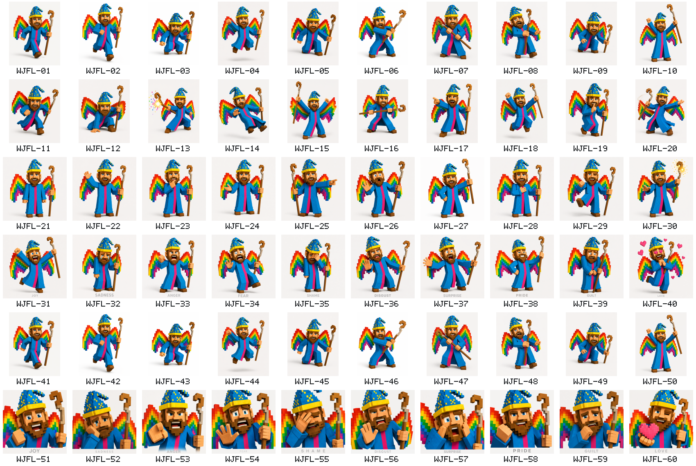

# Wizard Joe Feelings Queue

Status: `QUEUED` on 2026-07-13. No production pose geometry or runtime selection changed.

## Intake summary

| Field | Value |
|---|---|
| Source archive | `/Users/paul/Downloads/Wizard Joe Poses Feelings.zip` |
| Archive SHA-256 | `e2eaf187b8f01f4c955ab1659a6fa351129a8e2eb73eb3973f250bf6c6c4e6c7` |
| Preserved PNGs | 60 |
| Unique PNG hashes | 50 |
| Candidate IDs | `WJFL-01` through `WJFL-60` |
| Global integration orders | 31 through 90 |
| Semantic IDs | Deferred until visual intake |
| Runtime policy | Reference-only; Rust must procedurally generate accepted geometry and motion |

The full per-file queue, including source filename, order, ownership, status, and exact-duplicate links, is in [feelings-queue.json](feelings-queue.json). Hashes, dimensions, repository paths, and source disposition are in `evidence/pose-library-expansion/intake/feelings-manifest.json`.

## Visual index



The six contact-sheet rows are the integration batches:

1. `WJFL-01..10`: action and locomotion.
2. `WJFL-11..20`: action and gesture.
3. `WJFL-21..30`: conversation, reaction, and magic gesture.
4. `WJFL-31..40`: full-body joy, sadness, anger, fear, shame, disgust, surprise, pride, guilt, and love.
5. `WJFL-41..50`: byte-identical repeats of `WJFL-01..10` retained for archive fidelity.
6. `WJFL-51..60`: close-up versions of the ten labeled feelings.

## Reproduce the intake

After extracting only the non-`__MACOSX` PNGs to `evidence/pose-library-expansion/intake/feelings/`, run:

```bash
cd rust/wizard_avatar_pose_tool
cargo run --locked --bin wizard-avatar-feelings-intake -- \
  ../.. "/Users/paul/Downloads/Wizard Joe Poses Feelings.zip"
```

The Rust command regenerates `feelings-manifest.json`, `feelings-queue.json`, and the labeled contact sheet. It fails unless exactly 60 RGB PNGs are present.

## Future integration gate

- Assign semantic IDs only after inspecting each full-resolution source against the current 39-pose production library.
- Resolve exact repeats as aliases or `DUPLICATE`; do not compile duplicate cell geometry.
- Integrate one unique candidate at a time through the Rust animation graph.
- Preserve all anchors, contact markers, staff topology, body connectivity, and white-background composition.
- Run deterministic frame capture and source/decode/presentation parity before advancing the queue.
- Keep every source PNG out of the runtime bundle.
